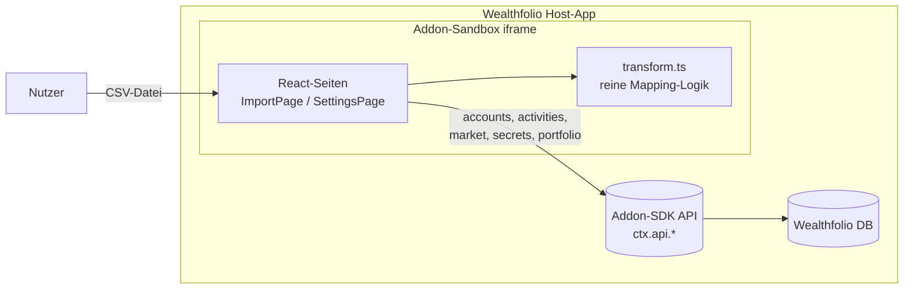
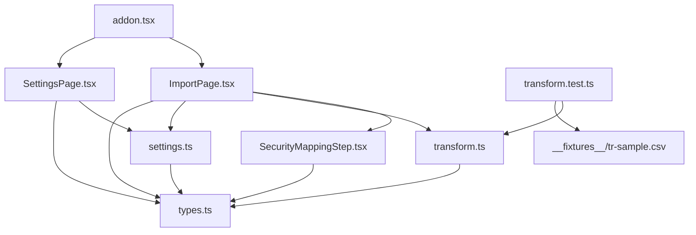
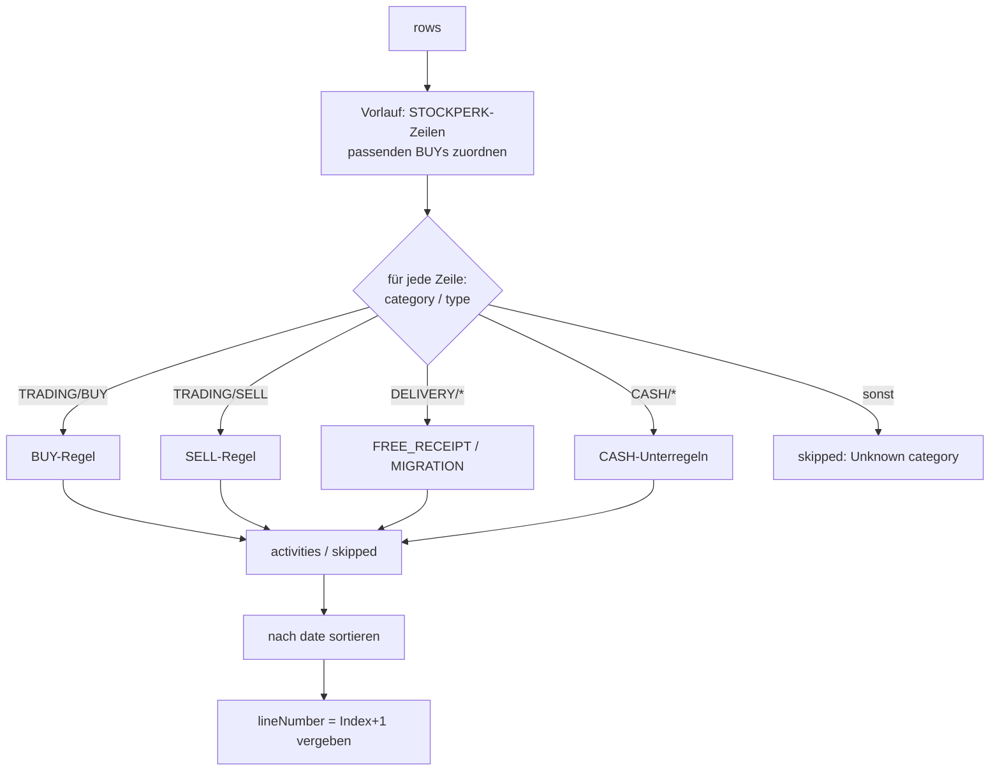
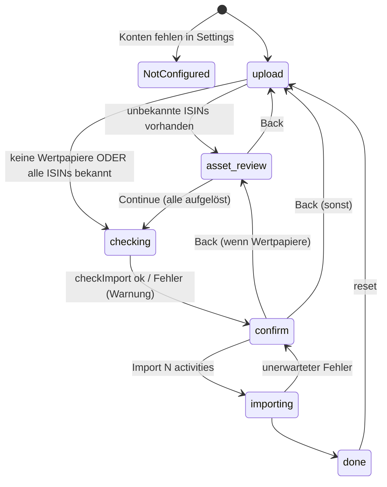
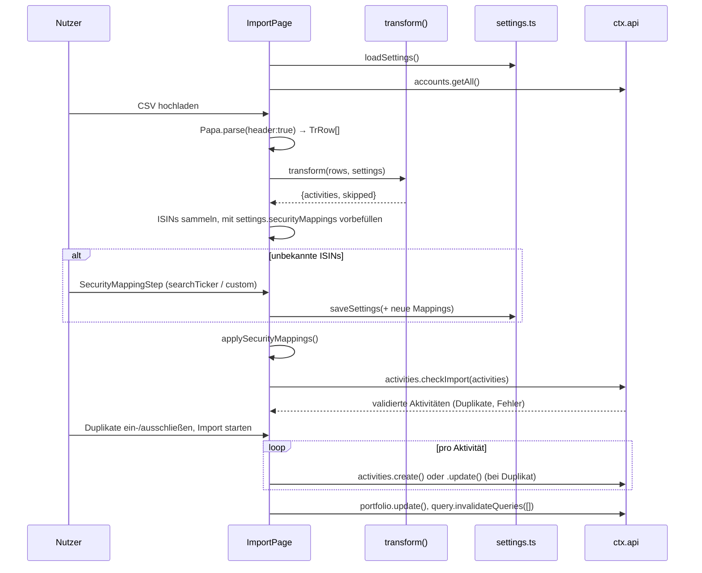
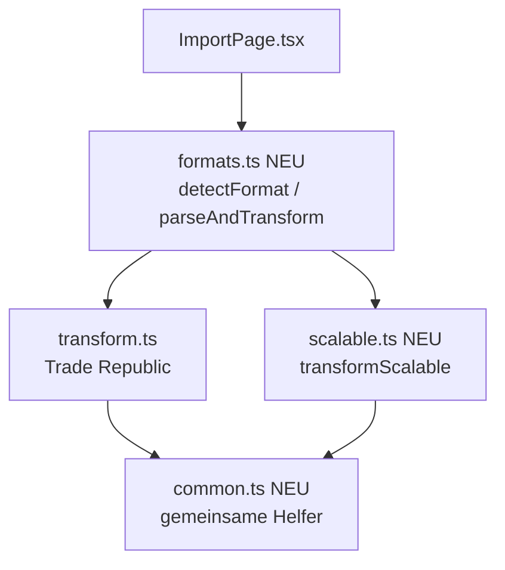

# Architektur – Broker Importer Addon (Trade Republic & Scalable Capital)

Dieses Dokument beschreibt den Aufbau des Addons so, dass Änderungen gezielt und
ohne Seiteneffekte vorgenommen werden können. Es ergänzt `CLAUDE.md` (Kurzreferenz
für Konventionen) und `CONTRIBUTING.md` (Beitragsprozess).

> Stand: Version 2.0.2 (`manifest.json` / `package.json`).
> Abschnitte 1–13 beschreiben den Trade-Republic-Kern; **Abschnitt 14** beschreibt den
> Scalable-Capital-Import und markiert alle Unterschiede zu Trade Republic.
> Zeilenangaben sind Orientierung, keine Garantie – bei Abweichungen gilt der Code.

---

## 1. Zweck und Kontext

Das Addon läuft **innerhalb von Wealthfolio** (Desktop-App für Portfolio-Tracking)
und importiert die CSV-Transaktionshistorie von **Trade Republic (TR)** als
Wealthfolio-Aktivitäten (`BUY`, `SELL`, `DEPOSIT`, `DIVIDEND`, `TRANSFER_IN/OUT`, …).



Es gibt **kein eigenes Backend** und **keinen eigenen Speicher**. Alles, was persistiert
wird (Konfiguration, Aktivitäten), geht über die vom Host bereitgestellte
`AddonContext`-API (`@wealthfolio/addon-sdk`).

### Kernidee: Zwei-Konten-Modell

TR führt Geld und Wertpapiere in *einem* Konto; Wealthfolio trennt sie. Der Nutzer
wählt daher zwei Wealthfolio-Konten:

| Konto | Typ in Wealthfolio | Erhält |
|---|---|---|
| **Cash-Konto** (`cashAccountId`) | `CASH` | Einzahlungen, Auszahlungen, Kartenzahlungen, Zinsen, Saveback, Gebühren |
| **Portfolio-Konto** (`portfolioAccountId`) | `SECURITIES` | Käufe, Verkäufe, Dividenden, Einlieferungen |

Damit die Salden beider Konten stimmen, erzeugt das Addon für jede Geldbewegung
zwischen ihnen ein **TRANSFER_OUT/TRANSFER_IN-Paar** (Details in Abschnitt 5).

---

## 2. Technologie-Stack und Build

| Bereich | Technologie | Hinweis |
|---|---|---|
| Sprache | TypeScript 6 (`strict`, `noUnusedLocals/Parameters`) | `tsconfig.json` |
| UI | React 19 + `@wealthfolio/ui` (shadcn-artige Komponenten) + Tailwind 4 | React/UI kommen **vom Host** |
| CSV-Parsing | `papaparse` | einzige echte Laufzeit-Abhängigkeit, wird gebündelt |
| Build | Vite 8 (Library-Mode, ES-Modul) | `vite.config.ts` |
| Tests | Vitest 4 | nur `transform.ts` ist getestet |
| Runtime | Node 24, pnpm 11 | `.tool-versions` |

**Build-Ausgabe:** genau eine Datei `dist/addon.js`. Host-Abhängigkeiten werden in
`vite.config.ts` als `external` markiert und **nicht** gebündelt:

```
@wealthfolio/addon-sdk, @wealthfolio/ui, react, react-dom, react-dom/client,
react/jsx-runtime, react/jsx-dev-runtime
```

Diese stehen zusätzlich als `peerDependencies` in `package.json` und als
`hostDependencies` in `manifest.json`. **Wer eine neue Host-Bibliothek nutzt, muss
alle drei Stellen synchron halten.** Neue npm-Pakete, die nicht vom Host kommen,
werden automatisch in `addon.js` gebündelt (→ `dependencies`).

`pnpm bundle` zippt `manifest.json`, `dist/addon.js` und `README.md` zu
`dist/broker-importer-addon.zip` – das installierbare Paket.

---

## 3. Modulübersicht

```
src/
├── addon.tsx               Einstiegspunkt: Sidebar, Routen, React-Root, Navigation
├── formats.ts              Formaterkennung (Kopfzeile) + Parsen + Weiterleitung an den Transformer
├── common.ts               Gemeinsame Helfer beider Transformer (makeCashAct, matchPattern, …)
├── scalable.ts             Scalable Capital: ScRow[] → ActivityImportEx[] (Abschnitt 14)
├── ImportPage.tsx          Import-Wizard (Zustandsautomat, SDK-Aufrufe, Import-Schleife)
├── SecurityMappingStep.tsx UI-Schritt: ISIN → Ticker zuordnen
├── SettingsPage.tsx        Einstellungen: Konten, Transfer-Patterns, Security-Mappings
├── settings.ts             Laden/Speichern der Konfiguration (ctx.api.secrets)
├── transform.ts            ★ Reine Geschäftslogik: TrRow[] → ActivityImportEx[]
├── types.ts                Gemeinsame Typen (TrRow, AddonSettings, …)
├── transform.test.ts       Unit- und Fixture-Tests für transform()
└── __fixtures__/
    ├── tr-sample.csv       14 Zeilen, deckt alle unterstützten TR-Typen ab
    └── scalable-sample.csv 26 erfundene Zeilen im Scalable-Format (Abschnitt 14)
```

### Abhängigkeitsgraph



### Schichten

| Schicht | Dateien | Regeln |
|---|---|---|
| **Domänenlogik** | `transform.ts`, `types.ts` | Rein, synchron, kein React, kein `ctx`. Vollständig unit-testbar. |
| **Persistenz** | `settings.ts` | Einzige Stelle, die `ctx.api.secrets` nutzt. |
| **Orchestrierung + UI** | `ImportPage.tsx` | Ruft `transform()`, SDK-APIs, steuert den Wizard. Enthält noch Logik (Mapping-Anwendung, Import-Schleife). |
| **Reine UI** | `SecurityMappingStep.tsx`, `SettingsPage.tsx` | Formulare / Darstellung; Mapping-Step ist zustandslos bzgl. Persistenz (Callbacks). |
| **Bootstrap** | `addon.tsx` | Registrierung beim Host; keine Fachlogik. |

**Leitprinzip:** Neue *Mapping-Regeln* gehören nach `transform.ts` (mit Tests), nicht
in die React-Komponenten.

---

## 4. Laufzeit: Lebenszyklus des Addons (`addon.tsx`)

Wealthfolio lädt `dist/addon.js` in einer Sandbox (iframe) und ruft den
Default-Export `enable(ctx)` auf.

1. **Sidebar-Eintrag** `ctx.sidebar.addItem({ id: "broker-importer", label: "Broker Import", icon: "bank", route: "/addon/broker-importer" })`.
2. **Drei Routen** über `ctx.router.add({ path, render })`:
   - `/addon/broker-importer` → Import
   - `/addon/broker-importer/import` → Import
   - `/addon/broker-importer/settings` → Settings
3. **Ein gemeinsamer React-Root.** Der Host übergibt *allen* Routen denselben
   DOM-Knoten. Deshalb wird `createRoot` nur einmal aufgerufen (`root ??= createRoot(...)`)
   und danach nur `root.render(...)`. Mehrere Roots auf demselben Knoten brechen das
   Rendering (siehe CHANGELOG 1.3.1). **Bei neuen Routen dieses Muster beibehalten.**
4. **`Nav`**: einfache Tab-Leiste, navigiert über `ctx.api.navigation.navigate(path)`.
5. **`ctx.onDisable`**: Root unmounten, Sidebar-Eintrag entfernen.

Jede Seite bekommt `ctx` als Prop; es gibt keinen globalen State/Context-Provider.

### 4.1 Addon-ID und Namen

| Merkmal | Wert | Bedeutung |
|---|---|---|
| `manifest.json` → `id` | `broker-importer` | Schlüssel, unter dem Wealthfolio das Addon, seine Routen und seine `secrets` führt |
| `ADDON_ID` in `addon.tsx` | `broker-importer` | muss mit der `id` übereinstimmen; bildet die Routen `/addon/broker-importer/…` |
| `package.json` → `name` | `broker-importer-addon` | npm-Paketname |
| Release-Paket | `dist/broker-importer-addon.zip` | Name in `package.json` (`bundle`) und `.github/workflows/release.yml` |

Bis einschließlich 1.4.0 lautete die `id` `trade-republic-importer`. **Eine Änderung der `id`
ist ein Bruch:** Wealthfolio behandelt das Addon dann als neues Addon. Das alte muss
deinstalliert werden, und die Einstellungen (Konten, Transfer-Patterns, Security-Mappings)
müssen neu eingerichtet werden, weil `secrets` an die `id` gebunden sind.

---

## 5. Domänenlogik: `transform.ts`

### 5.1 Signatur

```ts
transform(rows: TrRow[], config: AddonSettings): TransformResult
// TransformResult = { activities: ActivityImportEx[]; skipped: SkippedRow[] }
```

- `TrRow` = eine CSV-Zeile als String-Map (Spalten wie im TR-Export, siehe `types.ts`).
- `ActivityImportEx` = SDK-Typ `ActivityImport` **plus** optionales `transferGroupId`.
- `SkippedRow` = Zeilen, die bewusst oder mangels Regel nicht importiert werden.

Die Funktion ist **rein**: keine I/O, kein Zufall, keine Uhrzeit. Gleicher Input → gleicher Output.

### 5.2 Ablauf



1. **Vorlauf STOCKPERK:** Für jede `STOCKPERK`-Zeile wird ein `BUY` mit gleichem
   `symbol`, `date` und Betrag (auf Cent gerundet) gesucht. Dessen `transaction_id`
   landet in `stockperkFundedBuyIds` – diese Käufe sind von TR geschenkt und werden
   nicht aus dem Cash-Konto finanziert.
2. **Hauptschleife:** Eine lange `if`-Kaskade nach `category` + `type`. Jeder Zweig
   endet mit `continue`. Was durchfällt, landet in `skipped`.
3. **Sortierung** nach `date` (aufsteigend, stabil) und anschließend **Vergabe von
   `lineNumber`** (1-basiert). `lineNumber` ist der Schlüssel, über den die UI
   Aktivitäten nach `checkImport` wiedererkennt (siehe 6.3).

### 5.3 Hilfsfunktionen

Seit 1.4.0 liegen diese Helfer in `src/common.ts` und werden von `transform.ts` und
`scalable.ts` gemeinsam genutzt (`num` bleibt in `transform.ts`, Scalable hat `deNum`).
Neu ist `sortAndNumber(activities)` für Sortierung und `lineNumber`-Vergabe.

| Funktion | Zweck |
|---|---|
| `num(s)` | `parseFloat` mit `""`/`null` → `0` |
| `fmtAmt(n)` | Absolutwert, max. 6 Nachkommastellen, ohne Trailing Zeros, als String |
| `addSec(iso, s)` | Zeitstempel um *s* Sekunden verschieben (Reihenfolge innerhalb eines Vorgangs) |
| `timeTag(dt)` | Hängt ` [HH:MM:SS.ffffff]` an Kommentare – macht sonst identische Aktivitäten unterscheidbar, weil Wealthfolios Idempotenz-Key das Datum nicht berücksichtigt |
| `matchPattern(iban, desc, patterns)` | Transfer-Pattern suchen: (1) IBAN exakt auf `counterparty_iban`, (2) IBAN als Teilstring in `description`, (3) Keyword in `description` (case-insensitiv) |
| `makeCashAct(currency)` | Fabrik für Cash-Aktivitäten: `symbol = "$CASH-<Währung>"`, `quantity = unitPrice = "1"`, `amount` gesetzt |
| `isCashSymbol(symbol)` (exportiert) | `true` für jedes `$CASH-…`-Symbol, unabhängig von der Währung – von `ImportPage` genutzt, um Cash- von Wertpapier-Aktivitäten zu trennen |

### 5.4 Mapping-Tabelle (Ist-Zustand)

`C` = Cash-Konto, `P` = Portfolio-Konto, `D` = `destinationAccountId` eines Patterns,
`t` = `datetime` der Zeile. Gruppen-ID = `transferGroupId`.

| TR `category` / `type` | Erzeugte Aktivitäten | Gruppen-ID |
|---|---|---|
| `TRADING/BUY` (normal) | C `TRANSFER_OUT` (t−2s, Betrag+Gebühr+Steuer) → P `TRANSFER_IN` (t−1s) → P `BUY` (t) | `buy-<txid>` |
| `TRADING/BUY` (STOCKPERK-finanziert) | P `CREDIT`/`BONUS` (t−1s) → P `BUY` (t) | – |
| `TRADING/SELL` | P `SELL` (t) → P `TRANSFER_OUT` (t+1s, Erlös−Gebühr−Steuer) → C `TRANSFER_IN` (t+2s) | `sell-<txid>` |
| `DELIVERY/FREE_RECEIPT` | P `TRANSFER_IN` (Wertpapier, Depotübertrag) | – |
| `DELIVERY/MIGRATION` | → `skipped` (technischer ISIN-Wechsel) | – |
| `CASH/STOCKPERK` | ignoriert (im BUY-Zweig verarbeitet), **nicht** in `skipped` | – |
| `CASH/CUSTOMER_INBOUND`, `CUSTOMER_INPAYMENT` | C `DEPOSIT` | – |
| `CASH/TRANSFER_INBOUND`, `TRANSFER_INSTANT_INBOUND` | C `DEPOSIT` (bzw. `WITHDRAWAL` bei negativem Betrag) | – |
| `CASH/CUSTOMER_OUTBOUND_REQUEST`, `TRANSFER_OUTBOUND`, `TRANSFER_INSTANT_OUTBOUND`, `TRANSFER_DIRECT_DEBIT_INBOUND` | ohne Pattern: C `WITHDRAWAL`; Pattern ohne Ziel: C `TRANSFER_OUT`; Pattern mit Ziel: C `TRANSFER_OUT` + D `TRANSFER_IN` | `xfer-<txid>` (nur mit Ziel) |
| `CASH/CARD_TRANSACTION`, `CARD_TRANSACTION_INTERNATIONAL` | C `WITHDRAWAL` (Betrag inkl. Gebühr) bzw. `DEPOSIT` bei Erstattung | – |
| `CASH/CARD_ORDERING_FEE` | C `FEE` | – |
| `CASH/BENEFITS_SAVEBACK` | C `CREDIT`/`BONUS` (netto nach Steuer) | – |
| `CASH/DIVIDEND` | P `DIVIDEND` (bei Fremdwährung mit `fxRate = 1/fx_rate` und Originalbetrag) + optional P `TAX` → P `TRANSFER_OUT` (t+1s, netto) → C `TRANSFER_IN` (t+2s) | `div-<txid>` |
| `CASH/INTEREST_PAYMENT`, `MANUAL_CASH_TRANSFER` | C `INTEREST` + optional C `TAX` | – |
| anderer `CASH`-Typ | → `skipped` („Unknown CASH type") | – |
| andere `category` | → `skipped` („Unknown category") | – |

Weitere Konventionen:
- `instrumentType`: `asset_class === "STOCK"` → `EQUITY`, sonst `FUND`.
- Wertpapier-Aktivitäten verwenden zunächst die **ISIN als `symbol`**; die Auflösung
  auf echte Ticker passiert erst in der UI (Abschnitt 6.2).
- Gebühr und Steuer bei BUY/SELL werden zu `fee` zusammengefasst.

### 5.5 Invarianten (bei Änderungen unbedingt einhalten)

1. **Jedes interne TRANSFER_OUT/TRANSFER_IN-Paar braucht eine gemeinsame, eindeutige
   `transferGroupId`.** Sonst zählt Wealthfolio die Bewegung als Ausgabe (Spending).
   Schema: `<präfix>-<transaction_id>`.
2. **Outbound vs. Inbound:** Nur *ausgehende* CASH-Typen prüfen `transferPatterns`.
   Eingehende Typen sind immer `DEPOSIT` – absichtlich ohne Pattern-Matching.
3. **Zeitversatz** über `addSec` bestimmt die Reihenfolge innerhalb eines Vorgangs
   (Geld kommt vor dem Kauf an, verlässt das Depot nach dem Verkauf).
4. **Kommentare mit `timeTag`**, damit gleichartige Buchungen am selben Tag nicht
   als Duplikat zusammenfallen.
5. **`lineNumber` wird ausschließlich am Ende von `transform()` vergeben** und muss
   eindeutig bleiben.
6. Unbekanntes wird **nie stillschweigend verworfen**, sondern in `skipped` mit
   `reason` gemeldet (Ausnahme: `CASH/STOCKPERK`, das im BUY-Zweig steckt).
7. **`BUY`/`SELL` tragen immer `amount = tradeFinalCash(...)`** (`common.ts`): exakt
   `Menge × Stückpreis + Gebühr` (BUY) bzw. `− Gebühr` (SELL), mit BigInt statt Float
   berechnet. Wealthfolio bildet den Duplikat-Fingerabdruck (`idempotencyKey`) aus dem
   exakten `amount`. Fehlt er, leitet Wealthfolio ihn beim Anlegen genau so ab und
   speichert ihn – `checkImport` hasht aber den eingereichten Wert. Ohne `amount`
   würden Trades bei einem erneuten Import nie als Duplikat erkannt und doppelt angelegt.

---

## 6. Import-Wizard: `ImportPage.tsx`

### 6.1 Zustandsautomat



`type Step = "upload" | "asset-review" | "checking" | "confirm" | "importing" | "done"`.
Der gesamte Zustand liegt in `useState`-Hooks der Komponente (kein Store).

### 6.2 Datenfluss eines Imports



**Schritte im Detail:**

1. **Upload (`handleFile`)**: Dateiendung `.csv` prüfen, `file.text()`, `Papa.parse`.
2. **Transform**: `transform(parsed.data, settings)` → `parseResult`.
3. **Wertpapiere ermitteln**: alle Aktivitäten, deren `symbol` kein Cash-Symbol ist (`isCashSymbol`) → `SecurityInfo { isin, name, count }`.
4. **Vorbefüllung** aus `settings.securityMappings`. Sind *alle* ISINs bekannt, wird
   `SecurityMappingStep` übersprungen.
5. **`applySecurityMappings`**: ersetzt ISIN durch Ticker-Daten aus `SymbolSearchResult`
   (`symbol`, `exchangeMic`, `quoteCcy`, `instrumentType`, `providerId`, `assetId`, …).
   `"custom"` lässt die ISIN als Symbol stehen.
6. **`checkImport`**: Host validiert und markiert Duplikate (`duplicateOfId`) und Fehler.
   Bei Exception wird mit den ungeprüften Daten weitergemacht und eine Warnung gezeigt.
7. **Confirm**: Status je Aktivität über `activityStatus()`:
   - `duplicate` ⇔ `duplicateOfId` gesetzt (existiert bereits in der DB).
     `duplicateOfLineNumber` (Duplikat innerhalb der Datei) wird **bewusst ignoriert** –
     TRANSFER-Paare sehen sich zwangsläufig ähnlich.
   - `error` ⇔ `!isValid` oder `errors` nicht leer → wird nicht importiert.
   - sonst `valid`.
   Duplikate werden standardmäßig **aktualisiert**; der Nutzer kann sie per
   `excludedLines` (Set von `lineNumber`) überspringen.
8. **Import (`handleImport`)**: sequenziell, eine Aktivität pro SDK-Aufruf:
   - Duplikat → `ctx.api.activities.update({ id: duplicateOfId, … })`
   - sonst → `ctx.api.activities.create({ … })`
   - `asset`-Objekt wird aus den Symbolfeldern gebaut (Host legt Assets bei Bedarf an).
   - Fehler einzelner Aufrufe werden gezählt (`skippedCount`), nicht abgebrochen.
   - Danach `portfolio.update()` + `query.invalidateQueries([])` (Fehler hier sind unkritisch).
   - Ergebnis wird als synthetisches `ImportActivitiesResult` angezeigt.

### 6.3 `transferGroupId` → `sourceGroupId` (wichtigster Fallstrick)

- `ActivityImport` kennt kein `sourceGroupId`; `checkImport` **verwirft unbekannte Felder**.
- Daher wird vor dem Import eine Map `lineNumber → transferGroupId` aus dem
  **ursprünglichen** `parseResult.activities` gebaut (`lineNumber` überlebt `checkImport`).
- Beim `create`/`update` wird daraus `sourceGroupId` gesetzt.
- Weil das Addon Aktivitäten einzeln anlegt (nicht über die Bulk-Import-Pipeline),
  läuft Wealthfolios automatische Transfer-Verknüpfung nie – die explizite
  `sourceGroupId` ist die einzige Verknüpfung.

**Konsequenz:** Wer `lineNumber`-Vergabe, Sortierung oder Filterung *zwischen*
`transform()` und `handleImport` ändert, muss diese Zuordnung mitprüfen.

---

## 7. Security-Mapping: `SecurityMappingStep.tsx`

Kontrollierte Komponente – der Zustand (`Map<isin, SecurityMapping>`) liegt in `ImportPage`.

- `SecurityMapping = SymbolSearchResult | "custom"` (`types.ts`).
- `TickerSearchInput`: debounced (350 ms) `ctx.api.market.searchTicker(query)`,
  vorbelegt mit dem Wertpapiernamen (jüngster Name aus der Datei; ohne Namen die ISIN), zeigt max. 8 Treffer, markiert bereits existierende Assets.
- Pro Zeile: Ticker wählen, „Custom" (ISIN bleibt Symbol) oder Zuordnung löschen.
- „Mark All Custom" und „Continue" (erst aktiv, wenn alles aufgelöst).
- Callbacks: `onMappingsChange`, `onComplete(mappings)`, `onBack`.
  Persistenz macht `ImportPage.handleMappingsComplete` (merge in `settings.securityMappings` + `saveSettings`).

---

## 8. Konfiguration: `settings.ts` und `SettingsPage.tsx`

### 8.1 Datenmodell (`AddonSettings`)

```ts
{
  cashAccountId: string;          // Wealthfolio-Konto vom Typ CASH
  cashCurrency: string;           // Währung des Cash-Kontos (Default "EUR")
  portfolioAccountId: string;     // Wealthfolio-Konto vom Typ SECURITIES
  scalableCashAccountId: string;      // seit 1.4.0: eigenes Kontenpaar für Scalable Capital
  scalableCashCurrency: string;
  scalablePortfolioAccountId: string;
  transferPatterns: TransferPattern[];            // { iban?, keyword?, label, destinationAccountId? }
  securityMappings: Record<string, SecurityMapping>; // ISIN → Ticker | "custom"
}
```

### 8.2 Persistenz

- Gespeichert als **ein JSON-String** unter dem Schlüssel `"config"` via
  `ctx.api.secrets.get/set`.
- `loadSettings` merged gespeicherte Werte über `DEFAULT_SETTINGS`
  (`{ ...DEFAULT_SETTINGS, ...JSON.parse(raw) }`) – **neue Felder brauchen daher nur
  einen Default in `DEFAULT_SETTINGS`**, ältere Konfigurationen bleiben kompatibel.
  Achtung: Das Merge ist flach; verschachtelte Objekte werden nicht gemerged.
- Bei Lese-/Parsefehlern werden still die Defaults verwendet.

### 8.3 SettingsPage

- Lädt Konten (`accounts.getAll()`, nur aktive/nicht archivierte) und Settings.
- Kontoauswahl gefiltert nach `accountType` (`CASH` / `SECURITIES`); beim Wählen des
  Cash-Kontos wird `cashCurrency` aus der Kontowährung übernommen.
- Editor für Transfer-Patterns (IBAN, Keyword, Label, Zielkonto).
- Liste gespeicherter Security-Mappings mit Einzel-Löschen und „Clear all"
  (nötig, weil der Skip-Pfad im Import keinen „Clear"-Button zeigt).
- Speichern erst nach Klick auf „Save settings"; Pflicht: beide Konten gesetzt.

---

## 9. Berechtigungen (`manifest.json`)

Das Addon muss jede genutzte SDK-Funktion im Manifest deklarieren. Aktuelle Nutzung:

| Kategorie | Funktionen | Genutzt in |
|---|---|---|
| `accounts` | `getAll` | ImportPage, SettingsPage |
| `activities` | `checkImport`, `create`, `update` (`saveMany` deklariert, derzeit ungenutzt) | ImportPage |
| `assets` | `create` (deklariert; Assets entstehen implizit über `asset` im Create/Update) | – |
| `secrets` | `get`, `set` | settings.ts |
| `ui` | `sidebar.addItem`, `navigation.navigate`, `router.add`, `onDisable` | addon.tsx |
| `query` | `invalidateQueries` | ImportPage |
| `portfolio` | `update` | ImportPage |
| `market-data` | `searchTicker` | SecurityMappingStep |

**Neue SDK-Aufrufe ⇒ Eintrag in `permissions` ergänzen** (und Versions-Bump, da Manifest-Änderung).

---

## 10. Tests

- Nur `transform()` wird getestet (`src/transform.test.ts`), die UI nicht.
- **Unit-Tests** erzeugen Zeilen über `row({...overrides})` mit einer festen `CONFIG`.
- **Fixture-Test** liest `src/__fixtures__/tr-sample.csv` mit Papa Parse und prüft
  Gesamtanzahl (aktuell 14 Zeilen → 17 Aktivitäten + 1 skipped) und einzelne Fälle,
  inkl. der Invariante „jedes interne Paar teilt eine `transferGroupId`".
- Neue Transaktionstypen: **Fixture-Zeile ergänzen** (fiktive Daten, echtes Spaltenformat)
  und die Zähler im Fixture-Test anpassen (siehe `CONTRIBUTING.md`).

---

## 11. CI/CD und Release

| Workflow | Trigger | Schritte |
|---|---|---|
| `ci.yml` | PR auf `main` (außer Label `skip-ci`) | install → `type-check` → `test` → `build` |
| `release.yml` | Push auf `main` (außer `[skip-release]` in Commit-Message) | install → `type-check` → `test` → `bundle` → falls Tag `v<manifest.version>` fehlt: GitHub-Release mit CHANGELOG-Abschnitt, ZIP und `addon.js` |
| `opencode.yml` | Kommentar mit `/oc` bzw. `/opencode` | OpenCode-Agent (unabhängig vom Build) |

**Release-Gate:** Ein Release entsteht nur durch Versions-Bump. Bei Logikänderungen
(`src/`, Manifest-Berechtigungen/Metadaten) Version in **`manifest.json` und
`package.json`** erhöhen und `CHANGELOG.md` (`## [x.y.z] - YYYY-MM-DD`) ergänzen.
Die Überschrift muss exakt diesem Format folgen, sonst findet der `awk`-Extraktor
keine Release-Notes.

---

## 12. Änderungsleitfaden (Rezepte)

### 12.1 Neuen TR-Transaktionstyp unterstützen

1. In `transform.ts` einen Zweig im passenden `category`-Block **vor** dem
   „Unknown …"-Fallback einfügen, mit `continue` abschließen.
2. Cash-Buchungen über `cashAct(...)` erzeugen, Kommentare mit `+ timeTag(dt)`.
3. Bewegt der Vorgang Geld **zwischen eigenen Konten** → TRANSFER-Paar mit
   gemeinsamer `transferGroupId` (`<präfix>-${r.transaction_id}`), Zeitversatz via `addSec`.
4. Ausgehend? → `matchPattern` wie bei den bestehenden Outbound-Typen.
   Eingehend? → schlicht `DEPOSIT`, kein Pattern-Matching.
5. Unit-Test in `transform.test.ts` + Zeile in `tr-sample.csv`, Fixture-Zähler anpassen.
6. Versions-Bump (meist *minor*) + CHANGELOG.

### 12.2 Neues Einstellungsfeld

1. Feld in `AddonSettings` (`types.ts`) ergänzen.
2. Default in `DEFAULT_SETTINGS` (`settings.ts`) – sorgt für Rückwärtskompatibilität.
3. UI in `SettingsPage.tsx` (über `set({ … })`).
4. Nutzung in `transform.ts` (über `config`) bzw. `ImportPage.tsx`.
5. `CONFIG` in `transform.test.ts` ergänzen (sonst Typfehler).

### 12.3 Neue Seite / Route

1. Komponente `XyPage({ ctx })` anlegen.
2. In `addon.tsx` per `ctx.router.add({ path: \`/addon/${ADDON_ID}/xy\`, render: (c) => renderInto(<Wrapper/>, c) })`
   registrieren – **immer `renderInto` nutzen** (gemeinsamer Root).
3. Link in `Nav` ergänzen.
4. Neue SDK-Funktionen im Manifest deklarieren.

### 12.4 Neuer SDK-Aufruf

1. Funktion in `manifest.json` → `permissions` (passende `category`) eintragen.
2. Bei neuem Host-Paket: `vite.config.ts` (`external`), `package.json`
   (`peerDependencies` + `devDependencies`), `manifest.json` (`hostDependencies`).

### 12.5 Import-Verhalten ändern (Duplikate, Batch, Fortschritt)

- Alles in `ImportPage.handleImport`. Die `lineNumber → transferGroupId`-Zuordnung
  (6.3) muss erhalten bleiben.
- Ein Umstieg auf `activities.saveMany` / Bulk-Import würde Wealthfolios eigenen
  Transfer-Linker aktivieren – dann `sourceGroupId`-Logik neu bewerten.

---

## 13. Bekannte Schwachstellen / Refactoring-Kandidaten

Diese Punkte sind **beobachtet, nicht behoben** – relevant als Ausgangspunkt für Änderungen:

1. **Dreifach duplizierter Outbound-Pattern-Block** (`CUSTOMER_OUTBOUND_REQUEST`,
   `TRANSFER_DIRECT_DEBIT_INBOUND`, `TRANSFER_OUTBOUND/INSTANT`) – Kandidat für eine
   Hilfsfunktion `outboundTransfer(r, …)`. Leichte Unterschiede beim Kommentar
   (mit/ohne `cpname`) beachten.
2. **`transform()` als lange `if`-Kaskade** – für viele neue Typen wäre eine
   Handler-Tabelle `Record<string, (row) => Activity[]>` übersichtlicher.
3. **`ImportPage.tsx` (~850 Zeilen)** mischt UI und Logik; `applySecurityMappings`,
   `activityStatus` und der Payload-Bau in `handleImport` ließen sich in ein
   testbares Modul (z. B. `importer.ts`) auslagern.
4. **Sequenzieller Import**: ein SDK-Aufruf pro Aktivität – langsam bei großen
   Dateien; Fehler pro Aktivität werden nur gezählt, nicht angezeigt.
5. **`saveMany` und `assets.create`** sind deklariert, aber ungenutzt.
6. **Keine UI-Tests**; nur `transform()` ist abgesichert.
7. **STOCKPERK-Zuordnung** ist O(n·m) und matcht nur über Symbol/Datum/Betrag –
   bei zwei identischen Käufen am selben Tag gewinnt der erste.
8. **`opencode.yml`** hat uneinheitliche Einrückung unter `steps:` (7 vs. 8 Leerzeichen)
   und ist dadurch kein gültiges YAML (Parser-Fehler in Zeile 25) – der Workflow kann so nicht laufen.

---

## 14. Geplante Erweiterung: Scalable-Capital-CSV als Eingangsformat

> **Status: umgesetzt in Version 1.4.0.** Dieser Abschnitt wurde vor der Umsetzung als
> Plan geschrieben und beschreibt alle Änderungen, um zusätzlich Transaktionsexporte von **Scalable Capital**
> (Datei `scalable_transactions_export_<Datum>_de.csv`) zu importieren.
> Grundlage ist ein echter Export mit 240 Zeilen (2020–2026), dessen Struktur
> unten zusammengefasst ist. Personenbezogene Daten aus diesem Export (Depot-IDs,
> Order-IDs, Referenznummern) dürfen **nicht** in Fixture oder Tests landen.

**Legende:** **[Δ]** = Unterschied zum Trade-Republic-Format bzw. zum heutigen Verhalten,
**[=]** = identisch / wiederverwendbar, **[NEU]** = Konzept, das es heute nicht gibt,
**[?]** = Annahme, die vor der Umsetzung bestätigt werden sollte.

### 14.1 Entscheidungen vor der Umsetzung

Alle vier Empfehlungen wurden bestätigt und so umgesetzt.

| # | Frage | Empfehlung | Begründung |
|---|---|---|---|
| A | Trade Republic **ersetzen** oder Scalable **zusätzlich** unterstützen? | **Zusätzlich**, Format wird automatisch an der Kopfzeile erkannt | Bestehende TR-Imports und Tests bleiben unverändert; kein Bruch für bestehende Installationen. |
| B | Gleiche Wealthfolio-Konten für beide Broker oder **eigenes Kontenpaar** pro Broker? | **Eigenes Kontenpaar** für Scalable (Cash + Depot) | Wer beide Broker nutzt, würde sonst Scalable-Buchungen in die TR-Konten importieren. |
| C | Depotumzug-/Storno-Buchungen ohne Nettoeffekt (siehe 14.4) | **Paarweise verrechnen und als `skipped` melden** | Sonst entstehen künstliche Ein-/Ausbuchungen, die den Einstandswert verfälschen. |
| D | Addon-Name/Beschriftung | In 1.4.0 blieb die `id` `trade-republic-importer`; nur `name`, `description`, Sidebar-Label und Texte wurden allgemeiner. **Nachtrag:** Mit der Umbenennung in `broker-importer` (siehe 4.1) wurde die `id` bewusst geändert. | Eine neue `id` ist für Wealthfolio ein anderes Addon; gespeicherte Einstellungen (`secrets`) gehen dabei verloren. |

### 14.2 Formatvergleich (Datei-Ebene)

| Merkmal | Trade Republic (heute) | Scalable Capital | |
|---|---|---|---|
| Trennzeichen | `,` | `;` | **[Δ]** |
| Kodierung / Zeilenende | UTF-8, LF | UTF-8 **mit BOM**, CRLF | **[Δ]** BOM muss vor dem Header-Vergleich entfernt werden |
| Kopfzeile | englisch, `snake_case` (`datetime,date,…,transaction_id,…`) | deutsch: `Datum;Uhrzeit;Typ;Wertpapiername;ISIN;Wert;Stück;Buchungswährung;Gebühren;Steuern;Bruttobetrag;Notiz` | **[Δ]** dient zur Formaterkennung |
| Dezimalzeichen | `.` | `,` (z. B. `-3894,15`, `12,933359`) | **[Δ]** eigener Zahlenparser |
| Zeitstempel | eine Spalte `datetime`, ISO 8601 in UTC | `Datum` (`TT.MM.JJJJ`) + `Uhrzeit` (`HH:MM:SS`) in **Ortszeit Europe/Berlin** | **[Δ]** Umrechnung nach UTC nötig (Sommer-/Winterzeit) |
| Sonderfall Datum | – | `Datum` enthält vereinzelt zusätzlich ` 00:00:00` (z. B. `08.09.2026 00:00:00`) | **[Δ]** nur die ersten 10 Zeichen verwenden |
| Uhrzeit bei reinen Buchungen | echte Uhrzeit | `01:00:00` (Winter) bzw. `02:00:00` (Sommer) = Mitternacht UTC | **[Δ]** nur Trades haben echte Uhrzeiten |
| Sortierung | aufsteigend | **neueste zuerst** | **[=]** `transform` sortiert ohnehin |
| Kategorie + Typ | zwei Spalten `category` + `type` | eine Spalte `Typ`, gemischt deutsch/englisch (`Kauf`, `TAX`, `SWAP_OUT`, …), bei Wertpapierüberträgen **leer** | **[Δ]** |
| Wertpapier-ID | `symbol` (= ISIN) | `ISIN` | **[=]** inhaltlich gleich, ISIN bleibt Platzhalter-Symbol bis zum Security-Mapping |
| Wertpapiername | `name` | `Wertpapiername` (variiert über die Jahre, z. B. „… UCITS ETF" vs. „… (Acc)") | **[Δ]** Name nur zur Anzeige, nie als Schlüssel |
| Stückzahl | `shares` | `Stück` (Dezimalkomma, Sparpläne mit Bruchstücken) | **[Δ]** Format |
| Kurs | `price` | **fehlt** → `Bruttobetrag / Stück` | **[Δ]** |
| Betrag | `amount` (vorzeichenbehaftet) | `Wert` (vorzeichenbehaftet, Bedeutung je Typ siehe 14.3) | **[Δ]** |
| Gebühren / Steuern | `fee`, `tax` (negativ) | `Gebühren`, `Steuern` (**positiv**) | **[Δ]** Vorzeichen |
| Eindeutige ID | `transaction_id` (UUID) | **keine**; `Notiz` enthält bei Trades die Order-ID, sonst Referenz + Freitext | **[Δ]** **[NEU]** ID muss abgeleitet werden (14.6) |
| Gegenkonto | `counterparty_name`, `counterparty_iban` | **fehlt** | **[Δ]** Transfer-Patterns nur über `keyword` auf `Notiz` |
| Fremdwährung | `original_amount`, `original_currency`, `fx_rate` | nur `Buchungswährung` (im Beispiel immer EUR) | **[Δ]** Dividenden nur netto in EUR, keine Quellensteuer-Aufteilung |
| Anlageklasse | `asset_class` (`STOCK`/`FUND`) | **fehlt** | **[Δ]** `instrumentType` bleibt leer, bis das Security-Mapping ihn setzt |
| Karte, Saveback, Stockperk, MCC | vorhanden | **fehlt** | **[Δ]** diese Zweige werden nicht gebraucht |

Verifiziert über alle Zeilen des Beispiel-Exports:
- `Kauf`: `Wert = −(Bruttobetrag + Gebühren + Steuern)`
- `Verkauf`: `Wert = Bruttobetrag − Gebühren − Steuern`

### 14.3 Mapping-Tabelle Scalable → Wealthfolio

`C` = Scalable-Cash-Konto, `P` = Scalable-Depotkonto (Entscheidung B), `t` = Zeitstempel in UTC.
Alle Zeit-Versätze (`addSec`) und `transferGroupId`-Regeln aus 5.5 gelten unverändert.

| Scalable `Typ` | Häufigkeit im Beispiel | Erzeugte Aktivitäten | TR-Gegenstück | |
|---|---|---|---|---|
| `Kauf` | 91 | C `TRANSFER_OUT` (t−2s, \|Wert\|) → P `TRANSFER_IN` (t−1s) → P `BUY` (t; `quantity`=Stück, `unitPrice`=Bruttobetrag/Stück, `fee`=Gebühren+Steuern) | `TRADING/BUY` | **[=]** Logik, **[Δ]** Feldquellen |
| `Verkauf` | 10 | P `SELL` (t) → P `TRANSFER_OUT` (t+1s, Wert) → C `TRANSFER_IN` (t+2s) | `TRADING/SELL` | **[=]** Logik, **[Δ]** Feldquellen |
| `Dividende` (Wert > 0) | 47 | P `DIVIDEND` (amount=Wert, quantity="1") → P `TRANSFER_OUT` → C `TRANSFER_IN` | `CASH/DIVIDEND` | **[Δ]** keine Steuer-/FX-Aufteilung |
| `Dividende` (Wert < 0, `Notiz` enthält `CANCEL-<Ref>`) | 1 | **Storno:** Stornozeile **und** die ursprüngliche Dividende (gleiche ISIN, gleicher Betrag, `Notiz` enthält `<Ref>`) → beide `skipped`; die Neubuchung bleibt | – | **[NEU]** |
| `Zinsen` | 9 | C `INTEREST` | `INTEREST_PAYMENT` | **[=]** |
| `Einlage` | 21 | C `DEPOSIT` (immer, ohne Pattern-Prüfung) | `CUSTOMER_INBOUND` | **[=]** Eingangs-Regel |
| `Entnahme` | 6 | ohne Pattern: C `WITHDRAWAL`; mit Pattern (nur `keyword` auf `Notiz`): C `TRANSFER_OUT` (+ Zielkonto `TRANSFER_IN`) | `TRANSFER_OUTBOUND` | **[Δ]** kein IBAN-Abgleich |
| `TAX` (negativ, z. B. Vorabpauschale) | 19 | C `TAX` (\|Wert\|) | – (TR nur als Teil anderer Zeilen) | **[NEU]** |
| `Steuerrückerstattung` | 1 | C `CREDIT`, `subtype = TAX_REFUND` | – | **[NEU]** |
| `FEE` (z. B. „Entgelt PRIME+ Broker") | 8 | C `FEE` (\|Wert\|) | `CARD_ORDERING_FEE` | **[=]** |
| `SWAP_OUT` + leere Zeile mit gleicher `WWUM`-Referenz | 1 | **Fondsauflösung/Zwangsumtausch:** P `SELL` (Stück aus der Wertpapierzeile, Erlös = Wert der `SWAP_OUT`-Zeile) → P→C Transferpaar | – | **[NEU]** |
| `Dividende` + leere Zeile mit `Wert = 0` (gleiche ISIN, gleicher Tag, gleiche Referenz) | 1 | **Rückzahlung/Knock-out eines Zertifikats:** P `SELL` (Stück aus der Wertpapierzeile, Erlös = Wert der Dividende) → P→C Transferpaar | – | **[NEU]** **[?]** |
| leer (Wertpapierübertrag), paarweise verrechenbar | 24 | → `skipped` („Depotumzug/Umbuchung ohne Nettoeffekt"), siehe 14.4 | `DELIVERY/MIGRATION` | **[Δ]** Erkennung über Paare statt Typ |
| leer, nicht verrechenbar, Eingang | 0 | P `TRANSFER_IN` (Wertpapier, `unitPrice` = Wert/Stück) | `DELIVERY/FREE_RECEIPT` | **[=]** |
| leer, nicht verrechenbar, Ausgang | 0 | P `TRANSFER_OUT` (Wertpapier) | – | **[NEU]** |
| `Einlage` mit `SWITCH-` in `Notiz` + `Entnahme` gleichen Betrags (±7 Tage) | 1 Paar | beide → `skipped` (Cash-Teil des Depotumzugs) | – | **[NEU]** **[?]** |
| unbekannter `Typ` | – | → `skipped` („Unknown Scalable type") | Unknown category | **[=]** |

**[?] Offene Einzelfälle aus dem Beispiel:**
- `Einlage` 142,92 € mit `…-EUR-DISTRIBUTION-RKN` im Zuge des Depotumzugs: umgesetzt als normale `DEPOSIT`. **Weiterhin offen** – falls das eine Ausschüttung ist, wäre `DIVIDEND` richtiger.
- Rückzahlung eines Zertifikats (`Wert = 0` + `Dividende`): umgesetzt als `SELL`; die Erkennung beruht auf einem einzigen Beispiel.
- `instrumentType` wird für Scalable-Wertpapiere nicht gesetzt (keine Anlageklasse im Export); er kommt aus dem Security-Mapping. Bei „Custom"-Mapping bleibt er leer.
- `Entnahme`/`Einlage` gleichen Betrags an aufeinanderfolgenden Tagen ohne `SWITCH-` (z. B. 2.000 € am 14./15.08.2025) bleiben echte Ein-/Auszahlungen.

### 14.4 Wertpapierüberträge (leerer `Typ`) – Verrechnungsregel [NEU]

Beim Depotumzug (Dezember 2025) und bei Korrekturen bucht Scalable Positionen aus und
wieder ein. Das Vorzeichen von `Wert` ist dabei **nicht** immer die Richtung:

| Erkennungsmerkmal | Richtung |
|---|---|
| `Notiz` beginnt mit `CANCEL-` | Ausgang (storniert einen früheren Eingang, obwohl `Wert` positiv ist) |
| `Wert < 0` (z. B. `WWUM …`) | Ausgang |
| `Wert > 0` (`SWITCH-…`, `CORR-SWITCH-…`, `WWUM …`) | Eingang |
| `Wert = 0` | Ausgang (Rückzahlung, siehe 14.3) |

Algorithmus (pro ISIN):
1. Ausgänge und Eingänge mit **gleicher Stückzahl** paaren, jeweils mit dem zeitlich
   nächsten Gegenstück innerhalb von **7 Tagen**.
2. Gepaarte Zeilen → `skipped` mit Grund „Depotumzug/Umbuchung ohne Nettoeffekt".
3. Ungepaarte Ausgänge → zuerst Sonderfälle aus 14.3 prüfen (`SWAP_OUT`, Rückzahlung),
   sonst Wertpapier-`TRANSFER_OUT`.
4. Ungepaarte Eingänge → Wertpapier-`TRANSFER_IN`.

Ergebnis für den Beispiel-Export: alle 24 Umzugs-/Korrekturzeilen heben sich auf
(z. B. EMQQ: 4 Ausgänge, 4 Eingänge à 75 Stück), Bestände bleiben korrekt.

### 14.5 Änderungen an Modulen



| Datei | Änderung | |
|---|---|---|
| `src/common.ts` | **neu**: `makeCashAct`, `fmtAmt`, `addSec`, `timeTag`, `matchPattern`, `isCashSymbol` aus `transform.ts` hierher verschieben | **[Δ]** reine Verschiebung, Verhalten unverändert |
| `src/transform.ts` | importiert Helfer aus `common.ts`; Logik **unverändert** | **[=]** |
| `src/scalable.ts` | **neu**: `transformScalable(rows: ScRow[], config): TransformResult`, Zahlen-/Datumsparser, Storno-/Umzugs-Verrechnung | **[NEU]** |
| `src/formats.ts` | **neu**: `detectFormat(text)` (BOM entfernen, Kopfzeile vergleichen) und `parseAndTransform(text, settings)` → `{ format, result }`; wählt Trennzeichen und Transformer | **[NEU]** |
| `src/types.ts` | `ScRow` (Spalten 14.2); `AddonSettings` um Scalable-Konten erweitern (Entscheidung B), z. B. `scalableCashAccountId`, `scalablePortfolioAccountId` | **[Δ]** |
| `src/settings.ts` | Defaults für die neuen Felder (Rückwärtskompatibilität über das bestehende Merge, siehe 8.2) | **[Δ]** |
| `src/SettingsPage.tsx` | zweite Karte „Scalable Capital accounts"; Pflichtprüfung nur für die Konten des genutzten Brokers | **[Δ]** |
| `src/ImportPage.tsx` | `Papa.parse` + `transform()` durch `parseAndTransform()` ersetzen; erkanntes Format anzeigen; Fehlermeldung bei unbekannter Kopfzeile; Prüfung „Settings not configured" je Format; Texte allgemeiner | **[Δ]** |
| `src/addon.tsx` | Sidebar-Label allgemeiner (z. B. „Broker Import") | **[Δ]** Entscheidung D |
| `manifest.json` | `name`/`description`/`keywords` anpassen, `id` **unverändert**; keine neuen Berechtigungen nötig | **[Δ]** |
| `src/scalable.test.ts` | **neu**: Unit-Tests je Typ + Fixture-Test | **[NEU]** |
| `src/__fixtures__/scalable-sample.csv` | **neu**: erfundene Daten im echten Format (`;`, Dezimalkomma, BOM, CRLF), deckt jeden Typ und einen Depotumzug ab | **[NEU]** |
| `README.md`, `CLAUDE.md`, `CHANGELOG.md` | Scalable-Export-Anleitung, neue Dateien, Changelog | **[Δ]** |
| Version | **Minor-Bump auf 1.4.0** (neue Funktion, rückwärtskompatibel) | |

Unverändert bleiben: `SecurityMappingStep.tsx` (arbeitet mit ISINs, die auch Scalable
liefert), die Import-Schleife inkl. `lineNumber → transferGroupId → sourceGroupId` (6.3)
und die Duplikaterkennung über `checkImport`.

### 14.6 Neue Invarianten für `scalable.ts`

1. **Stabile IDs ohne `transaction_id`** [NEU]: `Kauf`/`Verkauf` nutzen die Order-ID aus
   `Notiz`; alle anderen Zeilen einen Hash aus `Datum|Uhrzeit|Typ|ISIN|Wert|Notiz`.
   **Nicht** die Zeilennummer verwenden – neue Exporte fügen Zeilen oben ein.
2. **Eigene Präfixe für `transferGroupId`** [Δ]: `sc-buy-`, `sc-sell-`, `sc-div-`,
   `sc-swap-`, `sc-xfer-`, damit sie nie mit TR-IDs kollidieren.
3. **Zeitzone** [NEU]: `Datum`+`Uhrzeit` werden als Europe/Berlin interpretiert und mit
   `Intl` nach UTC umgerechnet – nicht mit der Zeitzone des Rechners (CI läuft in UTC).
4. **Kommentare** enthalten `Notiz` bzw. Wertpapiername plus `timeTag`, damit gleiche
   Beträge am selben Tag (z. B. mehrere `TAX`-Zeilen um 01:00) unterscheidbar bleiben.
5. Alle Invarianten aus 5.5 gelten weiter.

### 14.7 Umsetzungsreihenfolge (erledigt)

1. `common.ts` herauslösen; TR-Tests müssen unverändert grün bleiben.
2. `scalable.ts` + Fixture + Tests (testgetrieben, ohne UI).
3. `formats.ts` + `ImportPage.tsx` anbinden.
4. Settings (Entscheidung B) + Texte/Manifest (Entscheidung D).
5. Doku (dieser Abschnitt wird zur Ist-Beschreibung), CHANGELOG, Version 1.4.0.

### 14.8 Ergebnis der Umsetzung

- Probelauf mit dem echten Export (240 Zeilen): 506 Aktivitäten, 28 übersprungene Zeilen
  (24 Umzugs-/Korrekturzeilen, 2 Dividenden-Storno, 2 Cash-Teil des Umzugs); kein
  Depotbestand wird negativ.
- Tests: `src/scalable.test.ts` (29 Tests: Parser, Zeitzone inkl. Sommer/Winter, jeder
  Typ, Storno, Umzug, `SWAP_OUT`, Rückzahlung, Formaterkennung, Fixture-Integration).
  Die Tests laufen unabhängig von der Zeitzone des Rechners.
- Rezept für neue Scalable-Typen: neuen `case` in Pass 4 von `transformScalable`
  ergänzen (bzw. einen eigenen Pass, wenn Zeilen paarweise verrechnet werden müssen),
  Zeile in `scalable-sample.csv` und Zähler im Fixture-Test anpassen.
