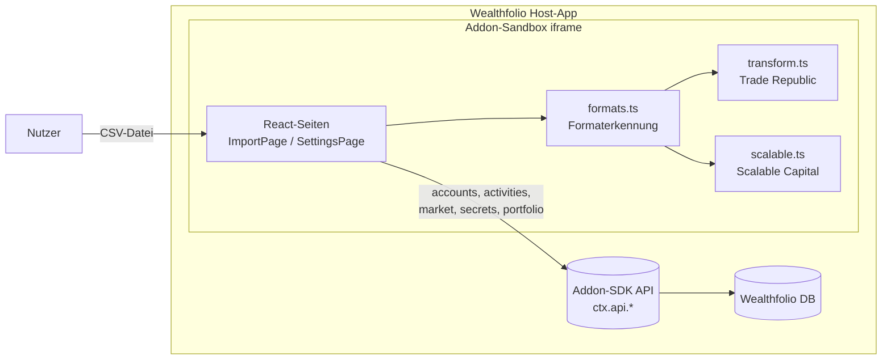
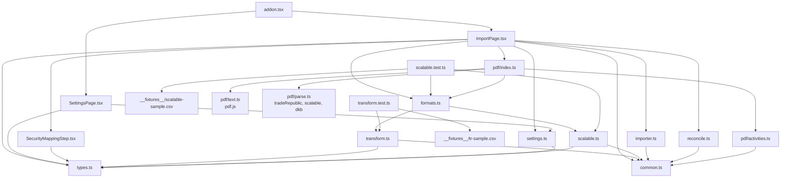
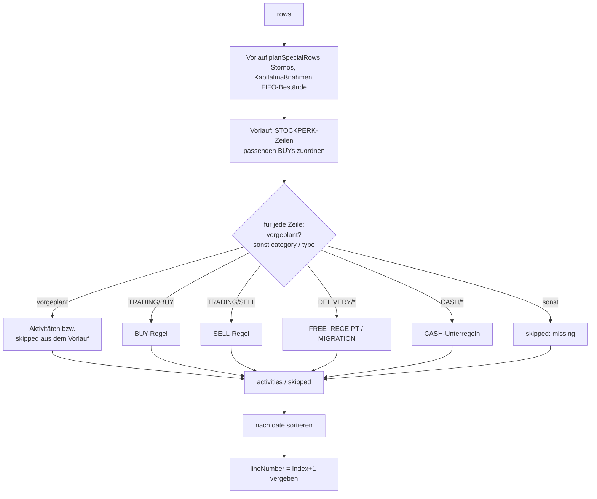
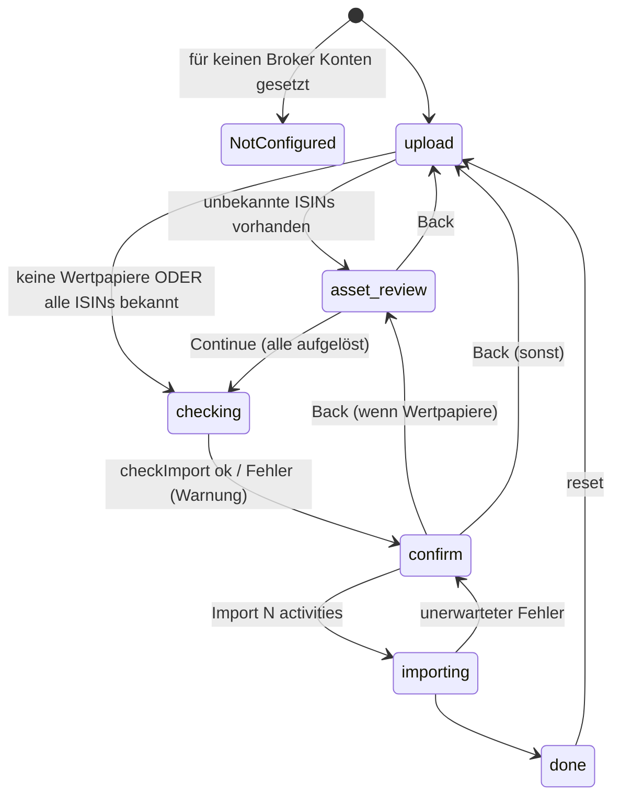
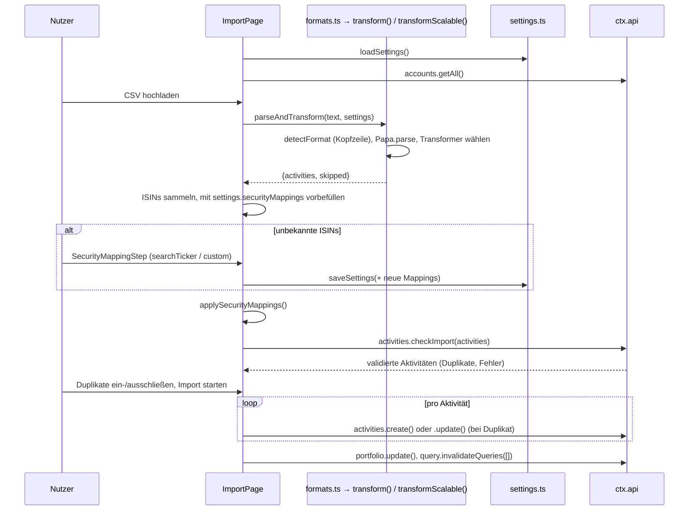
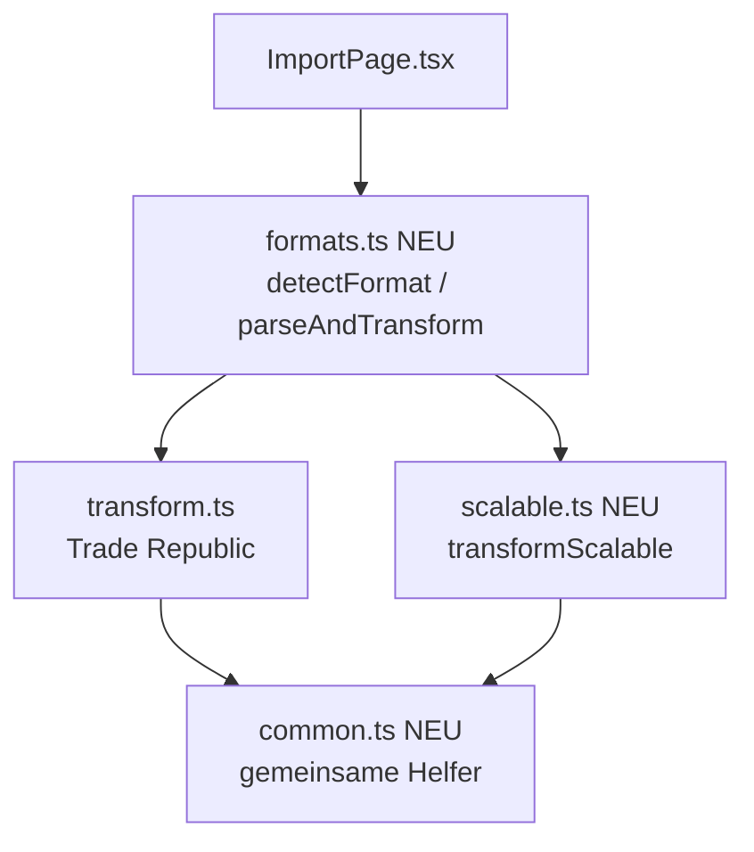
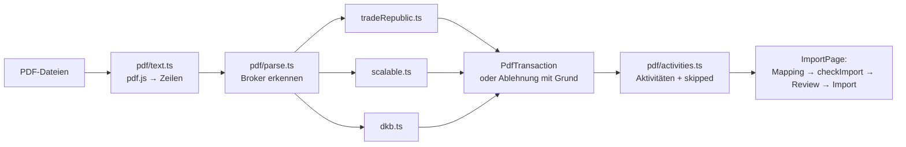

# Architektur – Broker Importer Addon (Trade Republic, Scalable Capital, DKB)

Dieses Dokument beschreibt den Aufbau des Addons so, dass Änderungen gezielt und
ohne Seiteneffekte vorgenommen werden können. Es ergänzt `CLAUDE.md` (Kurzreferenz
für Konventionen) und `CONTRIBUTING.md` (Beitragsprozess).

> Stand: Version 3.9.0 (`manifest.json` / `package.json`).
> Abschnitte 1–13 beschreiben den Aufbau und den Trade-Republic-Kern; **Abschnitt 14**
> beschreibt den Scalable-Capital-Import und markiert alle Unterschiede zu Trade Republic;
> **Abschnitt 15** listet alle Änderungen seit Version 1.3.3; **Abschnitt 16** beschreibt,
> wie die zunächst nicht unterstützten Trade-Republic-Typen (Ausschüttungen, Steuern,
> Kapitalmaßnahmen) in drei Stufen dazukamen; **Abschnitt 17** beschreibt den Import von
> PDF-Belegen (Trade Republic, Scalable Capital, DKB).
> Zeilenangaben sind Orientierung, keine Garantie – bei Abweichungen gilt der Code.

---

## 1. Zweck und Kontext

Das Addon läuft **innerhalb von Wealthfolio** (Desktop-App für Portfolio-Tracking)
und importiert CSV-Transaktionsexporte von Brokern als Wealthfolio-Aktivitäten
(`BUY`, `SELL`, `DEPOSIT`, `DIVIDEND`, `TRANSFER_IN/OUT`, …). Unterstützt werden
**Trade Republic (TR)** und **Scalable Capital**; das Format wird automatisch an der
Kopfzeile der Datei erkannt. Seit 2.10.0 kommen **PDF-Belege** (Kauf, Verkauf,
Dividende) von Trade Republic, Scalable Capital und **DKB** dazu, beliebig viele eines
Brokers pro Import (Abschnitt 17).



Es gibt **kein eigenes Backend** und **keinen eigenen Speicher**. Alles, was persistiert
wird (Konfiguration, Aktivitäten), geht über die vom Host bereitgestellte
`AddonContext`-API (`@wealthfolio/addon-sdk`).

### Kernidee: Zwei-Konten-Modell

Beide Broker führen Geld und Wertpapiere in *einem* Konto; Wealthfolio trennt sie. Der
Nutzer wählt daher **pro Broker** zwei Wealthfolio-Konten (für Scalable Capital
`scalableCashAccountId` / `scalablePortfolioAccountId`, siehe 8.1):

| Konto | Typ in Wealthfolio | Erhält |
|---|---|---|
| **Cash-Konto** (`cashAccountId`) | `CASH` | Einzahlungen, Auszahlungen, Kartenzahlungen, Zinsen, Saveback, Gebühren |
| **Portfolio-Konto** (`portfolioAccountId`) | `SECURITIES` | Käufe, Verkäufe, Dividenden, Einlieferungen, Kapitalmaßnahmen (Wertpapierwechsel, Splits, Aktiendividenden) |

Damit die Salden beider Konten stimmen, erzeugt das Addon für jede Geldbewegung
zwischen ihnen ein **TRANSFER_OUT/TRANSFER_IN-Paar** (Details in Abschnitt 5). Am Ende
hält das Portfolio-Konto **kein Bargeld** (5.5 Nr. 10): Was dort an Geld ankommt
(Verkauf, Dividende), wird vollständig zum Cash-Konto umgebucht, und alles, was dort
bezahlt wird (Kauf), kommt vorher vom Cash-Konto.

---

## 2. Technologie-Stack und Build

| Bereich | Technologie | Hinweis |
|---|---|---|
| Sprache | TypeScript 6 (`strict`, `noUnusedLocals/Parameters`) | `tsconfig.json` |
| UI | React 19 + `@wealthfolio/ui` (shadcn-artige Komponenten) + Tailwind 4 | React/UI kommen **vom Host** |
| CSV-Parsing | `papaparse` | Laufzeit-Abhängigkeit, wird gebündelt |
| PDF-Text | `pdfjs-dist` 4.10 (Legacy-Build, Apache-2.0) | seit 2.10.0; die vorminifizierten Dateien werden per Alias in `vite.config.ts` gebündelt (17.2) |
| Build | Vite 8 (Library-Mode, ES-Modul) | `vite.config.ts` |
| Tests | Vitest 4 | getestet sind die Transformer (`transform.ts`, `scalable.ts`), `formats.ts` und `common.ts`; die UI nicht |
| Runtime | Node 24, pnpm 11 | `.tool-versions` |

**Build-Ausgabe:** genau eine Datei `dist/addon.js` (seit 2.10.0 rund 2,5 MB, davon
gut 2 MB pdf.js). Host-Abhängigkeiten werden in
`vite.config.ts` als `external` markiert und **nicht** gebündelt:

```
@wealthfolio/addon-sdk, @wealthfolio/ui, react, react-dom, react-dom/client,
react/jsx-runtime, react/jsx-dev-runtime
```

Diese stehen zusätzlich als `peerDependencies` in `package.json` und als
`hostDependencies` in `manifest.json`. **Wer eine neue Host-Bibliothek nutzt, muss
alle drei Stellen synchron halten.** Neue npm-Pakete, die nicht vom Host kommen,
werden automatisch in `addon.js` gebündelt (→ `dependencies`).

`pnpm bundle` zippt `manifest.json`, `dist/addon.js` und `README.md` zu
`dist/broker-importer-addon.zip` – das installierbare Paket.

---

## 3. Modulübersicht

```
src/
├── addon.tsx               Einstiegspunkt: Sidebar, Routen, React-Root, Navigation
├── formats.ts              Formaterkennung (Kopfzeile) + Parsen + Weiterleitung an den Transformer
├── common.ts               Gemeinsame Helfer beider Transformer (makeCashAct, matchPattern, …)
├── scalable.ts             Scalable Capital: ScRow[] → ActivityImportEx[] (Abschnitt 14)
├── ImportPage.tsx          Import-Wizard: Zustand und Darstellung (Schritte, Tabellen, Abgleich, Ergebnis)
├── importer.ts             Import-Logik ohne React: Mapping, Status, Payloads, Import-Lauf, Fehler (seit 2.8.0)
├── SecurityMappingStep.tsx UI-Schritt: ISIN → Ticker zuordnen
├── SettingsPage.tsx        Einstellungen: Konten, Transfer-Patterns, Security-Mappings
├── settings.ts             Laden/Speichern der Konfiguration (ctx.api.secrets)
├── transform.ts            ★ Trade Republic: TrRow[] → ActivityImportEx[] (inkl. Vorlauf planSpecialRows)
├── reconcile.ts            Abgleich vor dem Import: Cash-Saldo, Bargeld im Depot, Bestände (6.5)
├── types.ts                Gemeinsame Typen (TrRow, ScRow, AddonSettings, SkippedRow/SkipKind, …)
├── pdf/                    PDF-Belege (seit 2.10.0, Abschnitt 17)
│   ├── index.ts            parsePdfFiles(): Dateien → ParseOutcome (wie parseAndTransform für CSV)
│   ├── text.ts             PDF → Textzeilen mit pdf.js (einzige Stelle mit pdf.js)
│   ├── parse.ts            Broker am Inhalt erkennen, an den Parser weiterreichen
│   ├── model.ts            PdfTransaction, Zahlen-/Datumsparser, Prüfungen
│   ├── tradeRepublic.ts    Parser Trade Republic
│   ├── scalable.ts         Parser Scalable Capital
│   ├── dkb.ts              Parser DKB
│   ├── activities.ts       PdfTransaction → Aktivitäten (Zwei-Konten-Modell)
│   └── pdf.test.ts         Tests der Parser, der Abbildung und von pdf.js (20 Tests)
├── transform.test.ts       Unit- und Fixture-Tests für transform() (73 Tests)
├── scalable.test.ts        Tests für scalable.ts, formats.ts, tradeFinalCash (33 Tests)
├── reconcile.test.ts       Tests für den Abgleich, inkl. beider Fixtures (9 Tests)
├── importer.test.ts        Tests für die Import-Logik mit nachgebautem ctx (19 Tests)
└── __fixtures__/
    ├── tr-sample.csv       26 Zeilen, deckt alle unterstützten TR-Typen ab
    ├── scalable-sample.csv 26 erfundene Zeilen im Scalable-Format (Abschnitt 14)
    └── pdf/                erfundene Belegtexte im Layout echter Belege (8 Dateien, 17.5)
```

### Abhängigkeitsgraph



### Schichten

| Schicht | Dateien | Regeln |
|---|---|---|
| **Domänenlogik** | `transform.ts`, `scalable.ts`, `common.ts`, `formats.ts`, `reconcile.ts`, `types.ts`, `pdf/*` | Rein, kein React, kein `ctx`. Vollständig unit-testbar. `formats.ts` ist die einzige Stelle, die CSV parst, `pdf/text.ts` die einzige, die PDFs liest (asynchron). |
| **Persistenz** | `settings.ts` | Einzige Stelle, die `ctx.api.secrets` nutzt. |
| **Import-Logik** | `importer.ts` | Kein React; `ctx` nur als übergebene `activities`-API (`create`/`update`). Vollständig unit-testbar (seit 2.8.0, #13 Stufe 1). |
| **Orchestrierung + UI** | `ImportPage.tsx` | Zustand und Darstellung des Wizards; ruft `parseAndTransform()`, `checkImport`, `reconcile()` und die Funktionen aus `importer.ts`. |
| **Reine UI** | `SecurityMappingStep.tsx`, `SettingsPage.tsx` | Formulare / Darstellung; Mapping-Step ist zustandslos bzgl. Persistenz (Callbacks). |
| **Bootstrap** | `addon.tsx` | Registrierung beim Host; keine Fachlogik. |

**Leitprinzip:** Neue *Mapping-Regeln* gehören in den Transformer des jeweiligen Brokers
(`transform.ts` bzw. `scalable.ts`, mit Tests), broker-übergreifende Helfer nach
`common.ts`, neue Broker-Formate über `formats.ts` (Rezept 12.6) – nicht in die
React-Komponenten.

---

## 4. Laufzeit: Lebenszyklus des Addons (`addon.tsx`)

Wealthfolio lädt `dist/addon.js` in einer Sandbox (iframe) und ruft den
Default-Export `enable(ctx)` auf.

1. **Sidebar-Eintrag** `ctx.sidebar.addItem({ id: "broker-importer", label: "Broker Import", icon: "bank", route: "/addon/broker-importer" })`.
2. **Drei Routen** über `ctx.router.add({ path, render })`:
   - `/addon/broker-importer` → Import
   - `/addon/broker-importer/import` → Import
   - `/addon/broker-importer/settings` → Settings
3. **Ein gemeinsamer React-Root.** Der Host übergibt *allen* Routen denselben
   DOM-Knoten. Deshalb wird `createRoot` nur einmal aufgerufen (`root ??= createRoot(...)`)
   und danach nur `root.render(...)`. Mehrere Roots auf demselben Knoten brechen das
   Rendering (siehe CHANGELOG 1.3.1). **Bei neuen Routen dieses Muster beibehalten.**
4. **`Nav`**: einfache Tab-Leiste, navigiert über `ctx.api.navigation.navigate(path)`.
5. **`ctx.onDisable`**: Root unmounten, Sidebar-Eintrag entfernen.

Jede Seite bekommt `ctx` als Prop; es gibt keinen globalen State/Context-Provider.

### 4.1 Addon-ID und Namen

| Merkmal | Wert | Bedeutung |
|---|---|---|
| `manifest.json` → `id` | `broker-importer` | Schlüssel, unter dem Wealthfolio das Addon, seine Routen und seine `secrets` führt |
| `ADDON_ID` in `addon.tsx` | `broker-importer` | muss mit der `id` übereinstimmen; bildet die Routen `/addon/broker-importer/…` |
| `package.json` → `name` | `broker-importer-addon` | npm-Paketname |
| Release-Paket | `dist/broker-importer-addon.zip` | Name in `package.json` (`bundle`) und `.github/workflows/release.yml` |

Bis einschließlich 1.4.0 lautete die `id` `trade-republic-importer`. **Eine Änderung der `id`
ist ein Bruch:** Wealthfolio behandelt das Addon dann als neues Addon. Das alte muss
deinstalliert werden, und die Einstellungen (Konten, Transfer-Patterns, Security-Mappings)
müssen neu eingerichtet werden, weil `secrets` an die `id` gebunden sind.

### 4.2 Updates

**Wie Wealthfolio Addons aktualisiert** (geprüft am Wealthfolio-Quellcode,
`crates/core/src/addons/service.rs`):
- Update-Prüfung und -Installation laufen **nur** über den Wealthfolio-Store
  (`https://wealthfolio.app/api/addons/update-check?addonId=…`, Download mit SHA-256 aus
  dem `distribution`-Block). Eine eigene Update-Adresse kann ein Addon nicht angeben, und
  es kann sich nicht selbst ersetzen. Der Store führt nur offizielle Addons; ein
  Community-Eintrag darf keinen `distribution`-Block haben (11) und bekommt daher weder
  In-App-Installation noch In-App-Updates.
- **„Install from File"** ersetzt nur den Ordner `addons/<id>/` (mit Sicherung während des
  Austauschs). Ein Addon mit gleicher `id` wird überschrieben, Deinstallieren ist nicht nötig.
- Die **Einstellungen** liegen im Schlüsselbund des Betriebssystems unter
  `addon:<id>:config` (`ctx.api.secrets`) und bleiben bei „Install from File" erhalten.

**Kein eigener Update-Hinweis mehr (seit 3.9.0):** Von 2.1.0 bis 2.11.0 fragte
`updateCheck.ts` täglich die GitHub-Releases ab (`ctx.api.network`, Host `api.github.com`)
und `UpdateBanner` zeigte eine neuere Version an. Beides ist mit der Community-Listung
entfernt (Entscheidung des Repo-Inhabers): Das Addon macht **keine Netzwerkzugriffe**,
das Manifest hat keine `network`-Berechtigung, und das Verzeichnis zeigt das als
abgeleitete Angabe. Preis: Nutzer erfahren von neuen Versionen nur über GitHub
(„Watch → Releases“) oder das Verzeichnis (README). Wer den Hinweis zurückholen will,
findet ihn im Git-Verlauf (`src/updateCheck.ts`, `src/UpdateBanner.tsx`, Stand 2.11.0).

---

## 5. Domänenlogik Trade Republic: `transform.ts` (Scalable: Abschnitt 14)

### 5.1 Signatur

```ts
transform(rows: TrRow[], config: AddonSettings): TransformResult
// TransformResult = { activities: ActivityImportEx[]; skipped: SkippedRow[] }
```

- `TrRow` = eine CSV-Zeile als String-Map (Spalten wie im TR-Export, siehe `types.ts`).
- `ActivityImportEx` = SDK-Typ `ActivityImport` **plus** optionales `transferGroupId`.
- `SkippedRow` = Zeilen, die bewusst oder mangels Regel nicht importiert werden:
  `{ datetime, type, category, description, reason, kind?, hint? }`. `kind` ist
  `netted` (absichtlich übersprungen, Wirkung ist abgedeckt – z. B. Storno und
  stornierte Zeile) oder `missing` (nicht importiert, Wealthfolio weicht vom Broker ab);
  `hint` sagt bei `missing`, was der Nutzer von Hand ergänzen kann. Texte auf Englisch,
  weil sie in der Addon-UI erscheinen.

Die Funktion ist **rein**: keine I/O, kein Zufall, keine Uhrzeit. Gleicher Input → gleicher Output.

### 5.2 Ablauf



1. **Vorlauf `planSpecialRows` (seit 2.5.0, vorher `dividendCorrections` +
   `mapCorporateActions`):** Zeilen, deren Bedeutung von *anderen* Zeilen abhängt, werden
   vorab entschieden und unter ihrer `transaction_id` abgelegt – entweder als fertige
   Aktivitäten (auch eine leere Liste, wenn eine andere Zeile die Wirkung bucht) oder als
   `skipped` mit Grund:
   - **Dividenden-Stornos:** negative Dividende + Gegenstück (gleiche ISIN, gleicher
     Betrag und gleiche Steuer mit umgekehrtem Vorzeichen; das zeitlich nächste) → beide
     `netted`.
   - **Aktiendividenden-Umbuchung:** −n hebt das zeitlich nächste +n derselben ISIN auf.
   - **FIFO-Bestände:** chronologischer Durchlauf über `BUY`, `SELL`, `FREE_RECEIPT` und
     die Kapitalmaßnahmen selbst; daraus Einstandswert bei Wertpapierwechseln und
     Verhältnis bei Splits (Details 16.2, 16.3).
   - **Wiederanlage:** `DIVIDEND_REINVESTMENT` + negative Dividendenzeile → finanzierter
     `BUY`.
   Die Hauptschleife prüft zuerst, ob eine Zeile vorgeplant ist.
2. **Vorlauf STOCKPERK:** Für jede `STOCKPERK`-Zeile wird ein `BUY` mit gleichem
   `symbol`, `date` und Betrag (auf Cent gerundet) gesucht. Dessen `transaction_id`
   landet in `stockperkFundedBuyIds` – diese Käufe sind von TR geschenkt und werden
   nicht aus dem Cash-Konto finanziert.
3. **Hauptschleife:** Eine lange `if`-Kaskade nach `category` + `type`. Jeder Zweig
   endet mit `continue`. Was durchfällt, landet in `skipped` (`missing`, mit Hinweis
   auf die Bargeldwirkung der Zeile, `moneyHint`).
4. **Sortierung** nach `date` (aufsteigend, stabil) und anschließend **Vergabe von
   `lineNumber`** (1-basiert). `lineNumber` ist der Schlüssel, über den die UI
   Aktivitäten nach `checkImport` wiedererkennt (siehe 6.3).

### 5.3 Hilfsfunktionen

Seit 1.4.0 liegen diese Helfer in `src/common.ts` und werden von `transform.ts` und
`scalable.ts` gemeinsam genutzt (`num` bleibt in `transform.ts`, Scalable hat `deNum`).

| Funktion | Zweck |
|---|---|
| `num(s)` (nur `transform.ts`) | `parseFloat` mit `""`/`null` → `0` |
| `fmtAmt(n)` | Absolutwert, max. 6 Nachkommastellen, ohne Trailing Zeros, als String |
| `addSec(iso, s)` | Zeitstempel um *s* Sekunden verschieben (Reihenfolge innerhalb eines Vorgangs) |
| `timeTag(dt)` | Hängt ` [HH:MM:SS.ffffff]` an Kommentare. Wealthfolios Duplikat-Fingerabdruck berücksichtigt nur den **Tag**, nicht die Uhrzeit, wohl aber den Kommentar (siehe 6.4) – so bleiben gleichartige Buchungen am selben Tag unterscheidbar |
| `matchPattern(iban, desc, patterns)` | Transfer-Pattern suchen: (1) IBAN exakt auf `counterparty_iban`, (2) IBAN als Teilstring in `description`, (3) Keyword in `description` (case-insensitiv) |
| `makeCashAct(currency)` | Fabrik für Cash-Aktivitäten: `symbol = "$CASH-<Währung>"`, `quantity = unitPrice = "1"`, `amount` gesetzt |
| `isCashSymbol(symbol)` | `true` für jedes `$CASH-…`-Symbol, unabhängig von der Währung – von `ImportPage` genutzt, um Cash- von Wertpapier-Aktivitäten zu trennen (seit 1.3.4) |
| `sortAndNumber(activities)` | Sortiert nach `date` und vergibt `lineNumber` (einzige Stelle dafür, siehe 5.5 Nr. 5) |
| `tradeFinalCash(type, qty, price, fee, tax?)` | Exakter `amount` für `BUY`/`SELL`: `qty × price + fee + tax` bzw. `− fee − tax`, mit BigInt statt Float (seit 2.0.2, `tax` seit 2.6.0; siehe 5.5 Nr. 7 und 6.4) |

Nur in `transform.ts`:

| Name | Zweck |
|---|---|
| `DIVIDEND_LIKE` | Typen, die wie eine Dividende gebucht werden, mit Kommentar-Präfix (`DIVIDEND`, `DISTRIBUTION`, `EXCHANGE`) |
| `TAX_ONLY` | Typen, die nur Steuer bewegen (Vorabpauschale, Steuerkorrekturen), mit Kommentartext |
| `SECURITY_EXCHANGE` | Kapitalmaßnahmen, bei denen eine ISIN gegen eine andere getauscht wird, mit Bezeichnung |
| `planSpecialRows(rows, config)` | Vorlauf für Zeilen, die von anderen Zeilen abhängen (5.2 Nr. 1) |
| `fmtPrice(n)` | wie `fmtAmt`, aber 10 Nachkommastellen (Stückpreise und Stückzahlen bei Kapitalmaßnahmen) |
| `moneyHint(r)` | Hinweistext für eine nicht unterstützte Zeile: um wie viel sie das TR-Bargeld verändert hat |

### 5.4 Mapping-Tabelle (Ist-Zustand)

`C` = Cash-Konto, `P` = Portfolio-Konto, `D` = `destinationAccountId` eines Patterns,
`t` = `datetime` der Zeile. Gruppen-ID = `transferGroupId`.

| TR `category` / `type` | Erzeugte Aktivitäten | Gruppen-ID |
|---|---|---|
| `TRADING/BUY` (normal) | C `TRANSFER_OUT` (t−2s, Betrag+Gebühr+Steuer) → P `TRANSFER_IN` (t−1s) → P `BUY` (t, `fee` = Gebühr, `tax` = Steuer, `amount` = `tradeFinalCash`) | `buy-<txid>` |
| `TRADING/BUY` (STOCKPERK-finanziert) | P `CREDIT`/`BONUS` (t−1s) → P `BUY` (t, `fee`/`tax` getrennt, `amount` = `tradeFinalCash`) | – |
| `TRADING/SELL` | P `SELL` (t, `fee` = Gebühr, `tax` = einbehaltene Steuer, `amount` = `tradeFinalCash` = Erlös − Gebühr − Steuer) → P `TRANSFER_OUT` (t+1s, Geldfluss) → C `TRANSFER_IN` (t+2s). Steuer**erstattung** (positive `tax`): zusätzlich P `CREDIT`/`TAX_REFUND`, mit umgebucht | `sell-<txid>` |
| `DELIVERY/FREE_RECEIPT` | P `TRANSFER_IN` (Wertpapier, Depotübertrag) | – |
| `DELIVERY/MIGRATION` | → `skipped` (`netted`, technischer ISIN-Wechsel) | – |
| `CASH/STOCKPERK` | ignoriert (im BUY-Zweig verarbeitet), **nicht** in `skipped` | – |
| `CASH/CUSTOMER_INBOUND`, `CUSTOMER_INPAYMENT` | C `DEPOSIT` | – |
| `CASH/TRANSFER_INBOUND`, `TRANSFER_INSTANT_INBOUND` | C `DEPOSIT` (bzw. `WITHDRAWAL` bei negativem Betrag) | – |
| `CASH/CUSTOMER_OUTBOUND_REQUEST`, `TRANSFER_OUTBOUND`, `TRANSFER_INSTANT_OUTBOUND`, `TRANSFER_DIRECT_DEBIT_INBOUND` | ohne Pattern: C `WITHDRAWAL`; Pattern ohne Ziel: C `TRANSFER_OUT`; Pattern mit Ziel: C `TRANSFER_OUT` + D `TRANSFER_IN` | `xfer-<txid>` (nur mit Ziel) |
| `CASH/CARD_TRANSACTION`, `CARD_TRANSACTION_INTERNATIONAL` | C `WITHDRAWAL` (Betrag inkl. Gebühr) bzw. `DEPOSIT` bei Erstattung | – |
| `CASH/CARD_ORDERING_FEE` | C `FEE` | – |
| `CASH/BENEFITS_SAVEBACK` | C `CREDIT`/`BONUS` (netto nach Steuer) | – |
| `CASH/DIVIDEND`, `DISTRIBUTION`, `EXCHANGE` | **eine** P `DIVIDEND` in der Auszahlungswährung mit `amount` = Nettobetrag und `tax` = Quellensteuer (Wealthfolio weist Ertrag brutto = `amount + tax` und die Steuer aus; seit 2.6.0, vorher eigene `TAX`-Zeile); bei Fremdwährung steht der Originalbetrag nur im Kommentar („… (8.01 USD)“) → P `TRANSFER_OUT` (t+1s, netto) → C `TRANSFER_IN` (t+2s). Kommentar-Präfix je Typ: „Dividend" / „Distribution" / „Exchange distribution" (Tabelle `DIVIDEND_LIKE`) | `div-<txid>` |
| `CASH/DIVIDEND`, `DISTRIBUTION`, `EXCHANGE` mit **negativem** Betrag | Storno: hebt die zeitlich nächste Zeile derselben ISIN mit gleichem Betrag und gleicher Steuer (umgekehrtes Vorzeichen) auf, beide → `skipped` (`netted`, `planSpecialRows`). Gehört sie zu einem `DIVIDEND_REINVESTMENT`, finanziert sie dessen BUY (siehe unten). Sonst → `skipped` (`missing`) | – |
| `CASH/EARNINGS`, `PRE_DETERMINED_TAX_BASE` (Vorabpauschale), `SEC_ACCOUNT`, `TAX_OPTIMIZATION` | Betrag = `amount + tax` (meist nur `tax`): negativ → C `TAX`, positiv → C `CREDIT`/`TAX_REFUND`, 0 → `skipped` (`netted`) (Tabelle `TAX_ONLY`) | – |
| `CASH/REFERRAL` | C `CREDIT`/`BONUS` (netto nach Steuer) | – |
| `CORPORATE_ACTION/SHARE_EXCHANGE`, `ADR_DISCONTINUATION`, `REORGANISATION`, `REVERSE_SPLIT` | P `TRANSFER_OUT` alte ISIN (t) + P `TRANSFER_IN` neue ISIN (t+1s), beide mit `unitPrice` = Einstandswert ÷ Stück (FIFO aus derselben Datei, `planSpecialRows`); Einstandswert unbekannt → beide Zeilen `skipped` (`missing`) | – (absichtlich ungepaart, siehe 16.2) |
| `CORPORATE_ACTION/WORTHLESS` | P `SELL` zu 0 (`fee` 0, `amount` 0), keine Cash-Umbuchung | – |
| `CORPORATE_ACTION/SPLIT` (gleiche ISIN, ±n Stück) | P `SPLIT` mit `amount` = Verhältnis (Bestand + n) ÷ Bestand, Bestand FIFO aus der Datei; ohne Bestand → `skipped` (`missing`) | – |
| `CORPORATE_ACTION/STOCK_DIVIDEND` | P `DIVIDEND`/`DIVIDEND_IN_KIND` (`quantity` n, `unitPrice` = `price`, `amount` = n × `price`) – Wealthfolio bucht Ertrag + Zugang, ohne Bargeld. +n/−n-Umbuchung derselben ISIN → beide `skipped` (`netted`); ohne Preis → `skipped` (`missing`) | – |
| `CORPORATE_ACTION/DIVIDEND_REINVESTMENT` + negative `CASH/DIVIDEND` derselben ISIN (≤ 7 Tage) | C `TRANSFER_OUT` (t−2s) → P `TRANSFER_IN` (t−1s) über den abgebuchten Betrag → P `BUY` n Stück; die negative Dividendenzeile erzeugt selbst nichts. Ohne Abbuchung → `skipped` (`missing`) | `buy-<txid>` |
| anderer `CORPORATE_ACTION`-Typ | → `skipped` (`missing`, mit Stückänderung und Hinweis) | – |
| `CASH/INTEREST_PAYMENT`, `MANUAL_CASH_TRANSFER` | **eine** C `INTEREST` mit `amount` = Nettobetrag und `tax` = Quellensteuer (seit 2.6.0, vorher eigene `TAX`-Zeile) | – |
| anderer `CASH`-Typ | → `skipped` (`missing`, Hinweis nennt die Bargeldwirkung) | – |
| andere `category` | → `skipped` (`missing`) | – |

Weitere Konventionen:
- `instrumentType`: `asset_class === "STOCK"` → `EQUITY`, sonst `FUND`.
- Wertpapier-Aktivitäten verwenden zunächst die **ISIN als `symbol`**; die Auflösung
  auf echte Ticker passiert erst in der UI (Abschnitt 6.2).
- **Gebühr und Steuer stehen in eigenen Feldern** (`fee`, `tax`; seit 2.6.0, vorher bei
  BUY/SELL zu `fee` zusammengefasst). In Wealthfolio ist `amount` immer der tatsächliche
  Geldfluss; Gebühr und Steuer werden daraus getrennt ausgewiesen
  (`portfolio-engine/compile.rs`: Ertrag = `amount + fee + tax`, SELL-Erlös =
  `amount + fee + tax`, BUY-Kosten = `amount − fee − tax`). Das Feld `tax` nimmt nur
  Belastungen auf; eine Erstattung wird eine eigene `CREDIT`/`TAX_REFUND`. Eigene
  `TAX`-Zeilen gibt es nur für Steuern ohne zugehörige Buchung (Vorabpauschale,
  Steuerkorrekturen).

### 5.5 Invarianten (bei Änderungen unbedingt einhalten)

1. **Jedes interne TRANSFER_OUT/TRANSFER_IN-Paar braucht eine gemeinsame, eindeutige
   `transferGroupId`.** Sonst zählt Wealthfolio die Bewegung als Ausgabe (Spending).
   Schema: `<präfix>-<transaction_id>`.
2. **Outbound vs. Inbound:** Nur *ausgehende* CASH-Typen prüfen `transferPatterns`.
   Eingehende Typen sind immer `DEPOSIT` – absichtlich ohne Pattern-Matching.
3. **Zeitversatz** über `addSec` bestimmt die Reihenfolge innerhalb eines Vorgangs
   (Geld kommt vor dem Kauf an, verlässt das Depot nach dem Verkauf).
4. **Kommentare mit `timeTag`**, damit gleichartige Buchungen am selben Tag nicht
   als Duplikat zusammenfallen.
5. **`lineNumber` wird ausschließlich am Ende von `transform()` vergeben** und muss
   eindeutig bleiben.
6. Unbekanntes wird **nie stillschweigend verworfen**, sondern in `skipped` mit
   `reason` gemeldet (Ausnahmen: `CASH/STOCKPERK`, das im BUY-Zweig steckt, und die
   negative Dividendenzeile, die eine Wiederanlage finanziert). Jede `SkippedRow` trägt
   `kind`: `netted` (absichtlich, Wirkung ist abgedeckt – kein Handlungsbedarf) oder
   `missing` (nicht importiert – Wealthfolio weicht ab), bei `missing` mit `hint`, was
   der Nutzer tun kann. Die UI zeigt das als Spalte „Status“ und sortiert `missing` nach
   oben.
7. **`BUY`/`SELL` tragen immer `amount = tradeFinalCash(...)`** (`common.ts`): exakt
   `Menge × Stückpreis + Gebühr + Steuer` (BUY) bzw. `− Gebühr − Steuer` (SELL), mit BigInt statt Float
   berechnet. Wealthfolio bildet den Duplikat-Fingerabdruck (`idempotencyKey`) aus dem
   exakten `amount`. Fehlt er, leitet Wealthfolio ihn beim Anlegen genau so ab und
   speichert ihn – `checkImport` hasht aber den eingereichten Wert. Ohne `amount`
   würden Trades bei einem erneuten Import nie als Duplikat erkannt und doppelt angelegt.
8. **Kommentare bestehender Typen nicht ändern.** Der Kommentar geht in den
   Duplikat-Fingerabdruck ein (6.4). Wer z. B. „Dividend …" umformuliert, lässt alle
   früher importierten Dividenden beim nächsten Import als neu erscheinen. Neue Typen
   bekommen deshalb eigene Präfixe (`DIVIDEND_LIKE`), statt bestehende anzufassen.
9. **Wertpapierwechsel nie mit `transferGroupId`.** Wealthfolio lehnt Übertrags-Paare
   zwischen zwei verschiedenen Wertpapieren ab („security transfer legs use different
   assets"). Der Einstandswert reist deshalb über `unitPrice` des ungepaarten
   `TRANSFER_IN` (16.2).
10. **Auf dem Portfolio-Konto bleibt kein Bargeld.** Jede Bargeld-Buchung dort (Dividende,
    Steuer, Kauf, Verkauf) muss in der Cash-Währung erfolgen und vollständig zum oder vom
    Cash-Konto umgebucht werden. Wealthfolio führt Bargeld pro Währung: eine `DIVIDEND`
    in USD neben `TAX` und Umbuchung in EUR ließ bis 2.3.1 USD-Guthaben und ein
    EUR-Minus auf dem Portfolio-Konto stehen.

---

## 6. Import-Wizard: `ImportPage.tsx`

### 6.1 Zustandsautomat



`type Step = "upload" | "asset-review" | "checking" | "confirm" | "importing" | "done"`.
Der gesamte Zustand liegt in `useState`-Hooks der Komponente (kein Store).

### 6.2 Datenfluss eines Imports



**Schritte im Detail:**

1. **Upload (`handleFile`)**: Dateiendung `.csv` prüfen, `file.text()`.
2. **Parsen + Transform**: `parseAndTransform(text, settings)` (`formats.ts`) erkennt das
   Format an der Kopfzeile, prüft, ob für diesen Broker Konten gesetzt sind, parst mit
   dem passenden Trennzeichen und ruft `transform()` bzw. `transformScalable()` auf.
   Fehler (unbekanntes Format, fehlende Konten, leere Datei) erscheinen als `fileError`.
   Das erkannte Format wird angezeigt.
3. **Wertpapiere ermitteln**: alle Aktivitäten, deren `symbol` kein Cash-Symbol ist
   (`isCashSymbol`) → `SecurityInfo { isin, name, count }`. Als `name` wird der
   **jüngste** Name aus der Datei verwendet (seit 2.0.1).
4. **Vorbefüllung** aus `settings.securityMappings`. Sind *alle* ISINs bekannt, wird
   `SecurityMappingStep` übersprungen.
5. **`applySecurityMappings`** (`importer.ts`): ersetzt ISIN durch Ticker-Daten aus `SymbolSearchResult`
   (`symbol`, `exchangeMic`, `quoteCcy`, `instrumentType`, `providerId`, `assetId`, …).
   `"custom"` lässt die ISIN als Symbol stehen. Ist die ISIN eine Aktie (irgendeine Zeile
   dieser ISIN hat `instrumentType: "EQUITY"`), bekommen alle ihre Zeilen
   `quoteMode: "MANUAL"`, das `handleImport` als `asset.quoteMode` weiterreicht:
   Wealthfolio lehnt Aktien ohne Marktdaten und ohne Börse sonst ab („Could not find '…'
   in market data", z. B. delistete Werte wie nach einer Insolvenz). Fonds bleiben
   unverändert, weil ein angefragter `quoteMode` auch ein vorhandenes Wertpapier
   umstellt und Fonds diese Prüfung nicht haben.
6. **`checkImport`**: Host validiert und markiert Duplikate (`duplicateOfId`, siehe 6.4)
   und Fehler. Bei Exception wird mit den ungeprüften Daten weitergemacht und eine
   Warnung gezeigt.
7. **Confirm**: Status je Aktivität über `activityStatus()`:
   - `duplicate` ⇔ `duplicateOfId` gesetzt (existiert bereits in der DB).
     `duplicateOfLineNumber` (Duplikat innerhalb der Datei) wird **bewusst ignoriert** –
     TRANSFER-Paare sehen sich zwangsläufig ähnlich.
   - `error` ⇔ `!isValid` oder `errors` nicht leer → wird nicht importiert.
   - sonst `valid`.
   Duplikate werden standardmäßig **aktualisiert**; der Nutzer kann sie per
   `excludedLines` (Set von `lineNumber`) überspringen.
   Der Reiter **„Skipped“** (bis 2.4.0 „Unsupported“) zeigt die `skipped`-Zeilen des
   Transformers mit Spalte **Status** („Not imported“ rot und oben, „No action needed“)
   und dem `hint` unter der Begründung; die Kopfzeile zählt „not imported“ und „netted
   out“ getrennt.
   Darüber steht seit 2.7.0 der **Abgleich** (6.5) mit Cash-Saldo, Bargeld auf dem
   Portfolio-Konto und Anzahl der Positionen; der Reiter **„Holdings“** listet die
   Bestände.
8. **Import (`handleImport` → `importer.ts`)**: `selectCandidates()` wählt die
   Aktivitäten (ohne Fehler, ohne vom Nutzer ausgeschlossene Duplikate), `runImport()`
   sendet sie sequenziell, eine Aktivität pro SDK-Aufruf:
   - `buildPayload()`: Duplikat → `activities.update({ id: duplicateOfId, … })`, sonst
     `activities.create({ … })`; `asset`-Objekt aus den Symbolfeldern (Host legt Assets
     bei Bedarf an), `fee` und `tax` getrennt (`tax` seit 2.6.0), `sourceGroupId` (6.3).
   - Ein fehlgeschlagener Aufruf bricht den Lauf nicht ab; er wird mit Wealthfolios
     Fehlermeldung als `FailedActivity` gesammelt (seit 2.8.0, vorher nur gezählt).
   - Danach `portfolio.update()` + `query.invalidateQueries([])` (Fehler hier sind unkritisch).
9. **Ergebnis („done“)**: Kacheln Total / Imported / Manually skipped / Failed. Gibt es
   Fehlschläge, zeigt eine Tabelle Datum, Konto, Typ, Symbol, Betrag und die Meldung von
   Wealthfolio; **„Retry N failed“** schickt nur diese Aktivitäten noch einmal durch
   `runImport()` – mit der gespeicherten `lineNumber → transferGroupId`-Zuordnung, damit
   Transferpaare ihre `sourceGroupId` behalten. „Copy as CSV“ zeigt die Liste als Text
   zum Kopieren (`failedAsCsv`; Downloads gehen in der Sandbox nicht).

### 6.3 `transferGroupId` → `sourceGroupId` (wichtigster Fallstrick)

- `ActivityImport` kennt kein `sourceGroupId`; `checkImport` **verwirft unbekannte Felder**.
- Daher baut `groupIdsByLine()` (`importer.ts`) vor dem Import eine Map
  `lineNumber → transferGroupId` aus dem **ursprünglichen** `parseResult.activities`
  (`lineNumber` überlebt `checkImport`). Die Map bleibt im Ergebnis gespeichert, damit ein
  „Retry“ dieselben `sourceGroupId`s setzt.
- Beim `create`/`update` wird daraus `sourceGroupId` gesetzt.
- Weil das Addon Aktivitäten einzeln anlegt (nicht über die Bulk-Import-Pipeline),
  läuft Wealthfolios automatische Transfer-Verknüpfung nie – die explizite
  `sourceGroupId` ist die einzige Verknüpfung.

**Konsequenz:** Wer `lineNumber`-Vergabe, Sortierung oder Filterung *zwischen*
`transform()` und `handleImport` ändert, muss diese Zuordnung mitprüfen.

### 6.4 Duplikaterkennung durch Wealthfolio (`idempotencyKey`)

Die Erkennung passiert nicht im Addon, sondern in Wealthfolio (Rust-Kern,
`crates/core/src/activities/idempotency.rs` und `activities_service.rs`, geprüft am
Wealthfolio-Quellcode vom 04.10.2026). `checkImport` bildet je Aktivität einen
SHA-256-Fingerabdruck und sucht ihn unter den gespeicherten Aktivitäten:

| Feld im Fingerabdruck | Hinweis |
|---|---|
| Konto, Aktivitätstyp | – |
| Datum | **nur der Tag**, ohne Uhrzeit |
| Wertpapier | Asset-UUID, falls das Asset existiert, sonst `symbol@MIC` bzw. `symbol` |
| Menge, Stückpreis, `amount`, Gebühr (wenn ≠ 0) | **exakte** Dezimalwerte (Absolutbeträge, ohne Rundung). **`tax` ist nicht enthalten** |
| Währung | – |
| Kommentar | Leerzeichen normalisiert |

Folgen für das Addon:
- **Kommentar mit `timeTag`** (5.3): sonst würden gleichartige Buchungen am selben Tag
  zusammenfallen.
- **`amount` bei `BUY`/`SELL`** (5.5 Nr. 7): Fehlt er, leitet Wealthfolio ihn beim
  Anlegen ab und speichert ihn im Fingerabdruck – `checkImport` hasht aber den
  eingereichten (leeren) Wert. Bis 2.0.1 wurden Trades deshalb bei einem erneuten Import
  **nicht** als Duplikat erkannt und doppelt angelegt. Seit 2.0.2 schickt das Addon genau
  den Wert, den Wealthfolio ableiten würde (`tradeFinalCash`); damit werden auch Trades
  aus älteren Versionen erkannt.
- Jede Änderung an Menge, Preis, Gebühr, Betrag, Kommentar oder Zeitstempel-Tag einer
  bestehenden Mapping-Regel ändert den Fingerabdruck: Bereits importierte Aktivitäten
  werden dann beim nächsten Import **nicht** mehr als Duplikat erkannt. Solche
  Änderungen sind deshalb verhaltensändernd und im CHANGELOG zu vermerken. Beispiel:
  2.4.0 bucht Fremdwährungs-Dividenden in EUR statt USD – die mit älteren Versionen
  importierten müssen vor dem Neuimport gelöscht werden (CHANGELOG „Upgrade note“).
  Ebenso 2.6.0: Steuer in `tax` statt in `fee` bzw. als eigene Zeile ändert `fee` bei
  Verkäufen mit Steuer und `amount` (netto statt brutto) bei Dividenden und Zinsen mit
  Steuer.

**Gleiche Transaktion aus einer anderen Quelle (seit 2.11.0, `matchExisting` in
`importer.ts`):** CSV und PDF desselben Brokers erzeugen andere Kommentare und Zeitpunkte,
`checkImport` erkennt sie also nicht. Nach `checkImport` liest `runCheckImport` daher die
bestehenden Aktivitäten der Konten mit Trades/Dividenden (`activities.getAll`) und sucht zu
jedem `BUY`/`SELL`/`DIVIDEND` (Status „valid“) eine bestehende Aktivität mit gleichem Konto,
Typ und Wertpapier (`assetSymbol` = Symbol oder gleiche `assetId`), höchstens 36 h Abstand,
gleicher Stückzahl (nicht bei Dividenden – die CSV-Exporte buchen dort Stück bzw. 1) und
Betrag ±0,02. Jede bestehende Aktivität passt höchstens einmal; die Ziele von
`duplicateOfId` sind ausgenommen. Zum Treffer gehören seine Überträge (das Paar, dessen
Bein auf diesem Konto ≤ 5 s daneben liegt und denselben Betrag hat – der Trade selbst
trägt keine `transferGroupId`) und eine `CREDIT`/`TAX_REFUND` im selben Zeitfenster.
Alle Zeilen der Transaktion landen vorausgewählt in `excludedLines`, die Review zeigt sie
als „In Wealthfolio“ und schaltet sie nur gemeinsam um. Schlägt das Lesen fehl, erscheint
ein Hinweis und es wird nichts ausgeschlossen. An echten Exporten (TR 1554, Scalable 506
Aktivitäten) und den zugehörigen PDFs wurden in beiden Richtungen genau die gemeinsamen
Transaktionen gefunden.

---

### 6.5 Abgleich vor dem Import (`reconcile.ts`, seit 2.7.0)

Der Review-Schritt zeigt, wie die beiden Konten des Brokers nach dem Import aussehen –
allein aus dem Transformer-Ergebnis, bevor etwas in Wealthfolio landet:

| Anzeige | Berechnung | Erwartung |
|---|---|---|
| Cash-Konto nach Import | Summe von `cashEffect()` aller Aktivitäten auf dem Cash-Konto, je Währung | = Broker-Saldo laut Datei |
| Broker-Saldo laut Datei | TR: Summe `amount + fee + tax` aller Zeilen (`trBrokerCash`); Scalable: Summe `Wert` aller Zeilen **mit** Typ (`scalableBrokerCash` – Zeilen ohne Typ sind Wertpapierüberträge mit Marktwert) | – |
| Bargeld auf dem Portfolio-Konto | `cashEffect()` der Aktivitäten auf dem Portfolio-Konto, je Währung | keins (5.5 Nr. 10) |
| Bestände („Holdings“) | Stück je Symbol in Datumsfolge: `BUY`/`TRANSFER_IN`/`DIVIDEND_IN_KIND` +, `SELL`/`TRANSFER_OUT` −, `SPLIT` × Verhältnis | kein Bestand unter 0 |

`cashEffect()` folgt Wealthfolio: `amount` ist der Geldfluss; `DEPOSIT`, `DIVIDEND`,
`INTEREST`, `CREDIT`, `SELL` und Cash-`TRANSFER_IN` erhöhen, `WITHDRAWAL`, `BUY`, `FEE`,
`TAX` und Cash-`TRANSFER_OUT` senken; Wertpapier-Überträge, `SPLIT` und
`DIVIDEND_IN_KIND` bewegen kein Bargeld.

Weicht das Cash-Konto vom Broker-Saldo ab, verweist die Anzeige auf die „Not
imported“-Zeilen unter „Skipped“ – in den Fixtures z. B. die absichtlich unbekannte
Scalable-Zeile (1 €). Die Bestände nutzen die ISINs aus der Datei, nicht die gemappten
Ticker. Ausgeschlossene Duplikate ändern nichts an der Berechnung: Sie existieren schon in
Wealthfolio. Der Abgleich gilt nur für den Inhalt der Datei; ohne vollständige Historie
weicht er vom Broker ab, darauf weist die Anzeige hin.

**Neue Aktivitätstypen:** `cashEffect()` und die Bestandsregeln in `reconcile()`
mitpflegen, sonst zeigt der Abgleich falsche Abweichungen.

---

## 7. Security-Mapping: `SecurityMappingStep.tsx`

Kontrollierte Komponente – der Zustand (`Map<isin, SecurityMapping>`) liegt in `ImportPage`.

- `SecurityMapping = SymbolSearchResult | "custom"` (`types.ts`).
- `TickerSearchInput`: debounced (350 ms) `ctx.api.market.searchTicker(query)`,
  vorbelegt mit dem Wertpapiernamen (jüngster Name aus der Datei; ohne Namen die ISIN), zeigt max. 8 Treffer, markiert bereits existierende Assets.
- Pro Zeile: Ticker wählen, „Custom" (ISIN bleibt Symbol) oder Zuordnung löschen.
- „Mark All Custom" und „Continue" (erst aktiv, wenn alles aufgelöst).
- Callbacks: `onMappingsChange`, `onComplete(mappings)`, `onBack`.
  Persistenz macht `ImportPage.handleMappingsComplete` (merge in `settings.securityMappings` + `saveSettings`).
- Seit 3.9.1 (#41): `mappingWarning` (`remap.ts`) warnt pro Zeile und in der Prüfung vor dem Import, wenn das
  Ziel verdächtig aussieht – Symbol ist eine andere ISIN, anderer Hebel (`3x` vs. `2x`) oder andere Richtung
  (Short/Long, Bear/Bull). Die Namen aus der Datei landen in `settings.securityNames` (`rememberNames`).

### 7.1 Zuordnung korrigieren (`remap.ts`, `RemapPanel.tsx`, seit 3.9.1, #41)

Eine falsche Zuordnung bucht alle Aktivitäten der ISIN auf ein fremdes Asset. In den Einstellungen öffnet
„Change" pro Zuordnung das `RemapPanel`: neues Ziel wählen (Ticker oder Custom), darunter alle Aktivitäten
der Depotkonten auf dem bisherigen Asset (`activitiesOnMapping`: Typen mit Asset, nach `assetId`/Symbol;
Cash-Überträge tragen kein Asset und bleiben). Auf dem Asset können auch Buchungen des echten Produkts
liegen – die ISIN steht nicht in den Kommentaren. Vorausgewählt sind deshalb nur die, deren Kommentar den
Namen aus der Datei enthält (`likelyOfSecurity`, Name aus `securityNames`); der Rest ist Nutzerentscheidung.
`remapActivities` schreibt jede gewählte Aktivität per `activities.update` mit dem neuen Asset und sonst
unveränderten Feldern (Kommentar, Betrag, Gebühr – Teil des Fingerabdrucks) und sammelt Fehler. Danach
wird die Zuordnung sofort gespeichert (auf den gespeicherten Settings, ungespeicherte Änderungen der Seite
bleiben ungespeichert) und `portfolio.update()` angestoßen.

---

## 8. Konfiguration: `settings.ts` und `SettingsPage.tsx`

### 8.1 Datenmodell (`AddonSettings`)

```ts
{
  cashAccountId: string;          // Wealthfolio-Konto vom Typ CASH
  cashCurrency: string;           // Währung des Cash-Kontos (Default "EUR")
  portfolioAccountId: string;     // Wealthfolio-Konto vom Typ SECURITIES
  scalableCashAccountId: string;      // seit 1.4.0: eigenes Kontenpaar für Scalable Capital
  scalableCashCurrency: string;
  scalablePortfolioAccountId: string;
  dkbCashAccountId: string;           // seit 2.10.0: Kontenpaar für DKB-PDF-Belege
  dkbPortfolioAccountId: string;
  transferPatterns: TransferPattern[];            // { iban?, keyword?, label, destinationAccountId? }
  securityMappings: Record<string, SecurityMapping>; // ISIN → Ticker | "custom"
  securityNames: Record<string, string>;             // seit 3.9.1: ISIN → Name aus der Datei
}
```

### 8.2 Persistenz

- Gespeichert als **ein JSON-String** unter dem Schlüssel `"config"` via
  `ctx.api.secrets.get/set`.
- `loadSettings` merged gespeicherte Werte über `DEFAULT_SETTINGS`
  (`{ ...DEFAULT_SETTINGS, ...JSON.parse(raw) }`) – **neue Felder brauchen daher nur
  einen Default in `DEFAULT_SETTINGS`**, ältere Konfigurationen bleiben kompatibel.
  Achtung: Das Merge ist flach; verschachtelte Objekte werden nicht gemerged.
- Bei Lese-/Parsefehlern werden still die Defaults verwendet.

### 8.3 SettingsPage

- Lädt Konten (`accounts.getAll()`, nur aktive/nicht archivierte) und Settings.
- Zwei Karten für Konten: **Trade Republic** und **Scalable Capital**, jeweils gefiltert
  nach `accountType` (`CASH` / `SECURITIES`); beim Wählen eines Cash-Kontos wird
  `cashCurrency` bzw. `scalableCashCurrency` aus der Kontowährung übernommen.
- Editor für Transfer-Patterns (IBAN, Keyword, Label, Zielkonto).
- Liste gespeicherter Security-Mappings mit Einzel-Löschen und „Clear all"
  (nötig, weil der Skip-Pfad im Import keinen „Clear"-Button zeigt), Warnhinweis bei verdächtigen
  Zuordnungen und „Change" zum Korrigieren samt Umhängen der Aktivitäten (7.1).
- Speichern erst nach Klick auf „Save settings". Pflicht: Für **mindestens einen** Broker
  sind beide Konten gesetzt, und kein Broker ist nur halb konfiguriert.
- Hinweis bei den Transfer-Patterns: Scalable-Exporte haben keine Gegen-IBAN, Patterns
  greifen dort nur über den Text in `Notiz`.

---

## 9. Berechtigungen (`manifest.json`)

Das Addon muss jede genutzte SDK-Funktion im Manifest deklarieren. Aktuelle Nutzung:

| Kategorie | Funktionen | Genutzt in |
|---|---|---|
| `accounts` | `getAll` | ImportPage, SettingsPage |
| `activities` | `checkImport`, `getAll` (seit 2.11.0, Abgleich mit dem Bestand, 6.4), `create`, `update` (`saveMany` deklariert, derzeit ungenutzt) | ImportPage |
| `assets` | `create` (deklariert; Assets entstehen implizit über `asset` im Create/Update) | – |
| `secrets` | `get`, `set` | settings.ts |
| `ui` | `sidebar.addItem`, `navigation.navigate`, `router.add`, `onDisable` | addon.tsx |
| `query` | `invalidateQueries` | ImportPage |
| `portfolio` | `update` | ImportPage |
| `market-data` | `searchTicker` | SecurityMappingStep |

Keine `network`-Berechtigung (seit 3.9.0, 4.2): Ohne sie blockiert die Laufzeit jeden
Netzwerkzugriff des Addons.

**Neue SDK-Aufrufe ⇒ Eintrag in `permissions` ergänzen** (und Versions-Bump, da Manifest-Änderung).

---

## 10. Tests

- 154 Tests in fünf Dateien; die Komponenten (`*.tsx`) selbst sind nicht getestet, ihre Logik liegt in `importer.ts`, `reconcile.ts` und `pdf/`.
- **`src/transform.test.ts`** (73 Tests, Trade Republic): Unit-Tests erzeugen Zeilen über
  `row({...overrides})` mit einer festen `CONFIG`. Der Fixture-Test liest
  `src/__fixtures__/tr-sample.csv` und prüft Gesamtanzahl (26 Zeilen → 34 Aktivitäten +
  1 skipped) und einzelne Fälle, inkl. der Invariante „jedes interne Paar teilt eine
  `transferGroupId`" und des exakten `amount` bei `BUY`/`SELL`.
- **`src/scalable.test.ts`** (33 Tests, Scalable Capital): Zahlen- und Zeitzonen-Parser
  (Sommer/Winter), jeder Typ, Storno, Depotumzug, `SWAP_OUT`, Rückzahlung,
  Formaterkennung, `tradeFinalCash`, Fixture-Test mit
  `src/__fixtures__/scalable-sample.csv` (26 Zeilen → 33 Aktivitäten + 9 skipped,
  Endbestände). Die Tests laufen unabhängig von der Zeitzone des Rechners.
- **`src/importer.test.ts`** (19 Tests, mit nachgebauter `activities`-API):
  `activityStatus`, `applySecurityMappings` (Ticker, „custom“ → MANUAL je ISIN),
  `selectCandidates`, `groupIdsByLine`, `buildPayload` (create/update, `tax`,
  `quoteMode`, `sourceGroupId`), `runImport` (Fortschritt, Fehlersammlung, Retry nur der
  Fehlschläge mit `sourceGroupId`, Zählung neu/aktualisiert), `failedAsCsv`,
  `importButtonLabel`, `matchExisting` (Treffer samt Überträgen, keine Treffer bei anderem
  Tag/Stück/Betrag/Wertpapier/Konto, Zuordnung über `assetId`, Dividenden ohne Stückvergleich,
  `duplicateOfId` ausgenommen).
- **`src/reconcile.test.ts`** (9 Tests): `cashEffect`, Cash-Saldo, Bargeld im Depot,
  Bestände mit Split/Dividende in Aktien/Wechsel, negative Bestände; Abgleich beider
  Fixtures gegen den Broker-Saldo aus der Datei (TR: Differenz 0; Scalable: −1 € durch
  die absichtlich nicht unterstützte Zeile).
- **`src/pdf/pdf.test.ts`** (20 Tests, PDF-Belege): Zahlenparser (deutsche und englische
  Schreibweise, Vorzeichen hinten), je Broker Kauf/Verkauf/Dividende aus den erfundenen
  Belegtexten in `src/__fixtures__/pdf/`, Abbildung auf Aktivitäten (Gruppen-IDs, Depot ohne
  Bargeld, Steuererstattung, doppelt hochgeladener Beleg, nicht unterstützter Beleg),
  Broker-Mischung, pdf.js-Zeilenbildung an einem im Test erzeugten PDF und ein Durchlauf
  PDF → Aktivitäten auf das DKB-Kontenpaar.
- `CONFIG` in `transform.test.ts` und `scalable.test.ts` muss alle Felder von
  `AddonSettings` enthalten.
- Neue Transaktionstypen: **Fixture-Zeile ergänzen** (fiktive Daten, echtes Spaltenformat)
  und die Zähler im Fixture-Test anpassen (siehe `CONTRIBUTING.md`).

---

## 11. CI/CD und Release

| Workflow | Trigger | Schritte |
|---|---|---|
| `ci.yml` | PR auf `main` (außer Label `skip-ci`) | install → `check:versions` → `type-check` → `test` → `build` |
| `release.yml` | Push auf `main` (außer `[skip-release]` in Commit-Message) | install → `check:versions` → `type-check` → `test` → `bundle` → falls Tag `v<manifest.version>` fehlt: GitHub-Release mit CHANGELOG-Abschnitt, ZIP und `addon.js` |
| `sdk-watch.yml` | wöchentlich (Mo 06:17 UTC) und manuell | vergleicht `@wealthfolio/addon-sdk` auf npm mit der eigenen Versionslinie; bei neuer Linie ein Issue „Release on Wealthfolio X.Y“ (nur eins je Linie) |

**Versionsschema (seit 3.9.0):** Die Version folgt Wealthfolio. `major.minor` ist die
Wealthfolio-/SDK-Linie, für die gebaut wird, der Patch zählt unsere Releases auf dieser
Linie (`3.9.0`, `3.9.1`, …) – Features und Fixes erhöhen beide den Patch, der CHANGELOG sagt
was es ist. `sdkVersion` und `minWealthfolioVersion` sind `<Linie>.0`, alle
`@wealthfolio/*`-Abhängigkeiten (package.json und Manifest `hostDependencies`)
`^<Linie>.0`; `scripts/check-versions.mjs` (`pnpm check:versions`) prüft das. Eine neue
Wealthfolio-Linie heißt: alles zusammen auf `<Linie>.0` heben, SDK-Changelog auf genutzte
APIs prüfen, releasen – auch ohne andere Änderungen. Dependabot lässt Minor/Major von
`@wealthfolio/*` aus (`dependabot.yml`), damit nichts außerhalb der Linie landet. Der
Sprung von 2.11.0 auf 3.9.0 ist eine Umnummerierung; die Release-Tags laufen ohne
Sonderfall weiter.

**Community-Verzeichnis:** Gelistet über `community/directory/broker-importer/addon.store.json`
im Repo `wealthfolio/wealthfolio-addons` (#32). Wealthfolio liest Lizenz, Kompatibilität
(`sdkVersion`, mindestens 3.6) und Datenzugriff (keine `network`-Berechtigung → keine
Daten verlassen das Gerät) aus diesem Repo; die Listing-`id` muss der Manifest-`id`
`broker-importer` entsprechen. Kein In-App-Install und keine In-App-Updates für
Community-Addons (4.2).

**Release-Gate:** Ein Release entsteht nur durch Versions-Bump. Bei Logikänderungen
(`src/`, Manifest-Berechtigungen/Metadaten) Version in **`manifest.json` und
`package.json`** erhöhen und `CHANGELOG.md` (`## [x.y.z] - YYYY-MM-DD`) ergänzen.
Die Überschrift muss exakt diesem Format folgen, sonst findet der `awk`-Extraktor
keine Release-Notes.

---

## 12. Änderungsleitfaden (Rezepte)

### 12.1 Neuen TR-Transaktionstyp unterstützen

1. In `transform.ts` einen Zweig im passenden `category`-Block **vor** dem
   „Unknown …"-Fallback einfügen, mit `continue` abschließen.
2. Cash-Buchungen über `cashAct(...)` erzeugen, Kommentare mit `+ timeTag(dt)`.
3. Bewegt der Vorgang Geld **zwischen eigenen Konten** → TRANSFER-Paar mit
   gemeinsamer `transferGroupId` (`<präfix>-${r.transaction_id}`), Zeitversatz via `addSec`.
4. Ausgehend? → `matchPattern` wie bei den bestehenden Outbound-Typen.
   Eingehend? → schlicht `DEPOSIT`, kein Pattern-Matching.
5. Hängt die Bedeutung von **anderen Zeilen** ab (Storno, Gegenbuchung, Bestand vor
   einer Kapitalmaßnahme), gehört die Regel in `planSpecialRows` statt in die
   Hauptschleife.
6. Bargeld auf dem Portfolio-Konto nur in der Cash-Währung und vollständig umbuchen
   (5.5 Nr. 10); Kommentare bestehender Typen nicht ändern (5.5 Nr. 8).
7. Was nicht importiert wird, mit `kind` und – bei `missing` – `hint` melden (5.5 Nr. 6).
8. Unit-Test in `transform.test.ts` + Zeile in `tr-sample.csv`, Fixture-Zähler anpassen.
   Neuer Aktivitätstyp oder Untertyp? `cashEffect()`/`reconcile()` mitpflegen (6.5).
   Mit einem echten Export prüfen: Der Abgleich im Review-Schritt zeigt keine Differenz
   zum Broker-Saldo und kein Bargeld im Depot – der Export selbst kommt nicht ins Repo.
9. Versions-Bump (meist *minor*) + CHANGELOG.

### 12.2 Neues Einstellungsfeld

1. Feld in `AddonSettings` (`types.ts`) ergänzen.
2. Default in `DEFAULT_SETTINGS` (`settings.ts`) – sorgt für Rückwärtskompatibilität.
3. UI in `SettingsPage.tsx` (über `set({ … })`).
4. Nutzung in `transform.ts` (über `config`) bzw. `ImportPage.tsx`.
5. `CONFIG` in `transform.test.ts` **und** `scalable.test.ts` ergänzen (sonst Typfehler).

### 12.3 Neue Seite / Route

1. Komponente `XyPage({ ctx })` anlegen.
2. In `addon.tsx` per `ctx.router.add({ path: \`/addon/${ADDON_ID}/xy\`, render: (c) => renderInto(<Wrapper/>, c) })`
   registrieren – **immer `renderInto` nutzen** (gemeinsamer Root).
3. Link in `Nav` ergänzen.
4. Neue SDK-Funktionen im Manifest deklarieren.

### 12.4 Neuer SDK-Aufruf

1. Funktion in `manifest.json` → `permissions` (passende `category`) eintragen.
2. Bei neuem Host-Paket: `vite.config.ts` (`external`), `package.json`
   (`peerDependencies` + `devDependencies`), `manifest.json` (`hostDependencies`).

### 12.5 Import-Verhalten ändern (Duplikate, Batch, Fortschritt)

- Logik in `importer.ts` (`selectCandidates`, `buildPayload`, `runImport`) ändern und in
  `importer.test.ts` absichern; `ImportPage.handleImport` ruft sie nur auf. Die
  `lineNumber → transferGroupId`-Zuordnung (6.3) muss erhalten bleiben.
- Ein Umstieg auf `activities.saveMany` / Bulk-Import würde Wealthfolios eigenen
  Transfer-Linker aktivieren – dann `sourceGroupId`-Logik neu bewerten.
- Duplikaterkennung hängt am Fingerabdruck aus 6.4 – Felder, die in ihn eingehen,
  nicht nebenbei ändern.

### 12.6 Neuen Broker (neues CSV-Format) anbinden

1. **Zeilentyp** in `types.ts` (wie `ScRow`), **Transformer** `src/<broker>.ts` mit
   Signatur `(rows, config) => TransformResult`; Helfer aus `common.ts` nutzen
   (`makeCashAct`, `matchPattern`, `addSec`, `timeTag`, `sortAndNumber`,
   `tradeFinalCash`).
2. **Alle Invarianten aus 5.5** einhalten, insbesondere eigene Präfixe für
   `transferGroupId` (z. B. `xy-buy-`), stabile IDs ohne Zeilennummer, `amount` bei Trades,
   Zeitstempel in UTC.
3. **`formats.ts`:** neuen Wert in `ImportFormat` und `FORMAT_LABEL`, Erkennung in
   `detectFormat` (eindeutiges Merkmal der Kopfzeile), Kontenpaar in `formatAccounts`,
   Parsen + Aufruf in `parseAndTransform`.
4. **Einstellungen:** eigenes Kontenpaar in `AddonSettings` + `DEFAULT_SETTINGS`
   (Rezept 12.2), Karte in `SettingsPage.tsx`, Speicherprüfung und
   „Settings not configured"-Prüfung in `ImportPage.tsx` um den Broker erweitern,
   Kontonamen in `accountName`.
5. **Tests + Fixture** mit erfundenen Daten im echten Format; Doku (diese Datei,
   README, `CLAUDE.md`), CHANGELOG, Minor-Bump.

---

## 13. Bekannte Schwachstellen / Refactoring-Kandidaten

Diese Punkte sind **beobachtet, nicht behoben** – relevant als Ausgangspunkt für Änderungen:

1. **Dreifach duplizierter Outbound-Pattern-Block** (`CUSTOMER_OUTBOUND_REQUEST`,
   `TRANSFER_DIRECT_DEBIT_INBOUND`, `TRANSFER_OUTBOUND/INSTANT`) – Kandidat für eine
   Hilfsfunktion `outboundTransfer(r, …)`. Leichte Unterschiede beim Kommentar
   (mit/ohne `cpname`) beachten.
2. **`transform()` als lange `if`-Kaskade** – für viele neue Typen wäre eine
   Handler-Tabelle `Record<string, (row) => Activity[]>` übersichtlicher.
3. ~~`ImportPage.tsx` mischt UI und Logik~~ – erledigt in 2.8.0: die Logik liegt in
   `importer.ts` (#13 Stufe 1). Stufe 2 (gemeinsames Paket für ein eigenes PDF-Addon)
   entfällt, weil der PDF-Import seit 2.10.0 im selben Addon liegt (17.1).
4. **Sequenzieller Import**: ein SDK-Aufruf pro Aktivität – langsam bei großen
   Dateien. Fehlschläge werden seit 2.8.0 einzeln angezeigt und lassen sich wiederholen.
5. **`saveMany` und `assets.create`** sind deklariert, aber ungenutzt.
6. **Keine Komponententests**; abgesichert sind Transformer, `formats.ts`, `common.ts`,
   `reconcile.ts` und `importer.ts`. Insbesondere die Zusammenarbeit mit Wealthfolio (`checkImport`,
   Anlegen von Aktivitäten) ist nur am echten Addon prüfbar.
7. **STOCKPERK-Zuordnung** ist O(n·m) und matcht nur über Symbol/Datum/Betrag –
   bei zwei identischen Käufen am selben Tag gewinnt der erste.
8. ~~**`opencode.yml`** war kein gültiges YAML~~ – erledigt: der Workflow wurde
   entfernt (nach 2.2.0, ohne Versionssprung).
9. **Doppelte Trades aus Versionen ≤ 2.0.1:** Wer eine Datei damals erneut importiert hat,
   hat doppelte `BUY`/`SELL` in Wealthfolio (siehe 6.4). Das Addon bereinigt sie nicht.
10. **Scalable-Annahmen** (14.3, „Offene Einzelfälle") sind nur an einem echten Export
    geprüft.
11. **Keine Updates in der App:** Community-Addons werden von Wealthfolio weder angeboten
    noch aktualisiert, und seit 3.9.0 zeigt das Addon auch selbst keine neue Version mehr an
    (4.2). Download und „Install from File" bleiben manuell; Nutzer müssen Releases auf
    GitHub oder im Verzeichnis verfolgen.
12. **TR-Kapitalmaßnahmen:** Bestand und Einstandswert für Wertpapierwechsel und Splits
    (Stufen 2 und 3) stammen aus der importierten Datei – bei unvollständiger Historie werden die
    Zeilen übersprungen; ein späterer Import mit längerer Historie kann einen anderen
    `unitPrice` ergeben und wird dann nicht als Duplikat erkannt.
13. **Nur am Wealthfolio-Quellcode geprüft, nicht im echten Wealthfolio:** `SPLIT` mit
    dem Verhältnis in `amount`, `DIVIDEND_IN_KIND`, `SELL` zu 0 (`WORTHLESS`) und
    `quoteMode: "MANUAL"` für „custom“-Aktien. Erst ein echter Import zeigt, ob
    `checkImport` sie annimmt. Dasselbe gilt für das Feld `tax` (seit 2.6.0).
14. ~~Scalable fasste Gebühr und Steuer bei Trades zu `fee` zusammen~~ – erledigt in 2.9.0
    (#26). Dividenden bleiben ohne Steueraufteilung, weil der Export bei Dividenden nur den
    Nettobetrag liefert. Für Brutto und Steuer gibt es seit 2.10.0 den PDF-Beleg (17).
15. **PDF-Import** (17.6): ein DKB-Verkauf ist nur an Beispieltexten geprüft. Der Abgleich
    CSV ↔ PDF (6.4, seit 2.11.0) sucht nach Inhalt; zwei echte, gleiche Käufe am selben
    Tag würden einander zugeordnet – die Review zeigt sie, „Include“ hebt das auf.

---

## 14. Scalable-Capital-CSV als Eingangsformat

> **Status: umgesetzt in Version 1.4.0.** Dieser Abschnitt wurde vor der Umsetzung als
> Plan geschrieben und beschreibt alle Änderungen, um zusätzlich Transaktionsexporte von **Scalable Capital**
> (Datei `scalable_transactions_export_<Datum>_de.csv`) zu importieren. Die Datei stammt nicht
> von Scalable selbst, sondern vom Userscript
> [Scalable Capital Transactions Exporter](https://github.com/matthesvoss/Scalable-Capital-Transactions-Exporter)
> (Tampermonkey, Menüpunkt „Export Transactions CSV DE“). Nur die **DE**-Variante passt
> (`;`, deutsche Spaltennamen); die EN-Variante (`,`, englische Spalten) erkennt
> `detectFormat` nicht. Ändert das Userscript sein Format, bricht der Import – dann
> `formats.ts` und `scalable.ts` anpassen.
> Grundlage ist ein echter Export mit 240 Zeilen (2020–2026), dessen Struktur
> unten zusammengefasst ist. Personenbezogene Daten aus diesem Export (Depot-IDs,
> Order-IDs, Referenznummern) dürfen **nicht** in Fixture oder Tests landen.

**Legende:** **[Δ]** = Unterschied zum Trade-Republic-Format bzw. zum heutigen Verhalten,
**[=]** = identisch / wiederverwendbar, **[NEU]** = Konzept, das es heute nicht gibt,
**[?]** = Annahme, die vor der Umsetzung bestätigt werden sollte.

### 14.1 Entscheidungen vor der Umsetzung

Alle vier Empfehlungen wurden bestätigt und so umgesetzt.

| # | Frage | Empfehlung | Begründung |
|---|---|---|---|
| A | Trade Republic **ersetzen** oder Scalable **zusätzlich** unterstützen? | **Zusätzlich**, Format wird automatisch an der Kopfzeile erkannt | Bestehende TR-Imports und Tests bleiben unverändert; kein Bruch für bestehende Installationen. |
| B | Gleiche Wealthfolio-Konten für beide Broker oder **eigenes Kontenpaar** pro Broker? | **Eigenes Kontenpaar** für Scalable (Cash + Depot) | Wer beide Broker nutzt, würde sonst Scalable-Buchungen in die TR-Konten importieren. |
| C | Depotumzug-/Storno-Buchungen ohne Nettoeffekt (siehe 14.4) | **Paarweise verrechnen und als `skipped` melden** | Sonst entstehen künstliche Ein-/Ausbuchungen, die den Einstandswert verfälschen. |
| D | Addon-Name/Beschriftung | In 1.4.0 blieb die `id` `trade-republic-importer`; nur `name`, `description`, Sidebar-Label und Texte wurden allgemeiner. **Nachtrag:** Mit der Umbenennung in `broker-importer` (siehe 4.1) wurde die `id` bewusst geändert. | Eine neue `id` ist für Wealthfolio ein anderes Addon; gespeicherte Einstellungen (`secrets`) gehen dabei verloren. |

### 14.2 Formatvergleich (Datei-Ebene)

| Merkmal | Trade Republic (heute) | Scalable Capital | |
|---|---|---|---|
| Trennzeichen | `,` | `;` | **[Δ]** |
| Kodierung / Zeilenende | UTF-8, LF | UTF-8 **mit BOM**, CRLF | **[Δ]** BOM muss vor dem Header-Vergleich entfernt werden |
| Kopfzeile | englisch, `snake_case` (`datetime,date,…,transaction_id,…`) | deutsch: `Datum;Uhrzeit;Typ;Wertpapiername;ISIN;Wert;Stück;Buchungswährung;Gebühren;Steuern;Bruttobetrag;Notiz` | **[Δ]** dient zur Formaterkennung |
| Dezimalzeichen | `.` | `,` (z. B. `-3894,15`, `12,933359`) | **[Δ]** eigener Zahlenparser |
| Zeitstempel | eine Spalte `datetime`, ISO 8601 in UTC | `Datum` (`TT.MM.JJJJ`) + `Uhrzeit` (`HH:MM:SS`) in **Ortszeit Europe/Berlin** | **[Δ]** Umrechnung nach UTC nötig (Sommer-/Winterzeit) |
| Sonderfall Datum | – | `Datum` enthält vereinzelt zusätzlich ` 00:00:00` (z. B. `08.09.2026 00:00:00`) | **[Δ]** nur die ersten 10 Zeichen verwenden |
| Uhrzeit bei reinen Buchungen | echte Uhrzeit | `01:00:00` (Winter) bzw. `02:00:00` (Sommer) = Mitternacht UTC | **[Δ]** nur Trades haben echte Uhrzeiten |
| Sortierung | aufsteigend | **neueste zuerst** | **[=]** `transform` sortiert ohnehin |
| Kategorie + Typ | zwei Spalten `category` + `type` | eine Spalte `Typ`, gemischt deutsch/englisch (`Kauf`, `TAX`, `SWAP_OUT`, …), bei Wertpapierüberträgen **leer** | **[Δ]** |
| Wertpapier-ID | `symbol` (= ISIN) | `ISIN` | **[=]** inhaltlich gleich, ISIN bleibt Platzhalter-Symbol bis zum Security-Mapping |
| Wertpapiername | `name` | `Wertpapiername` (variiert über die Jahre, z. B. „… UCITS ETF" vs. „… (Acc)") | **[Δ]** Name nur zur Anzeige, nie als Schlüssel |
| Stückzahl | `shares` | `Stück` (Dezimalkomma, Sparpläne mit Bruchstücken) | **[Δ]** Format |
| Kurs | `price` | **fehlt** → `Bruttobetrag / Stück` | **[Δ]** |
| Betrag | `amount` (vorzeichenbehaftet) | `Wert` (vorzeichenbehaftet, Bedeutung je Typ siehe 14.3) | **[Δ]** |
| Gebühren / Steuern | `fee`, `tax` (negativ) | `Gebühren`, `Steuern` (**positiv**) | **[Δ]** Vorzeichen |
| Eindeutige ID | `transaction_id` (UUID) | **keine**; `Notiz` enthält bei Trades die Order-ID, sonst Referenz + Freitext | **[Δ]** **[NEU]** ID muss abgeleitet werden (14.6) |
| Gegenkonto | `counterparty_name`, `counterparty_iban` | **fehlt** | **[Δ]** Transfer-Patterns nur über `keyword` auf `Notiz` |
| Fremdwährung | `original_amount`, `original_currency`, `fx_rate` | nur `Buchungswährung` (im Beispiel immer EUR) | **[Δ]** Dividenden nur netto in EUR, keine Quellensteuer-Aufteilung |
| Anlageklasse | `asset_class` (`STOCK`/`FUND`) | **fehlt** | **[Δ]** `instrumentType` bleibt leer, bis das Security-Mapping ihn setzt |
| Karte, Saveback, Stockperk, MCC | vorhanden | **fehlt** | **[Δ]** diese Zweige werden nicht gebraucht |

Verifiziert über alle Zeilen des Beispiel-Exports:
- `Kauf`: `Wert = −(Bruttobetrag + Gebühren + Steuern)`
- `Verkauf`: `Wert = Bruttobetrag − Gebühren − Steuern`

### 14.3 Mapping-Tabelle Scalable → Wealthfolio

`C` = Scalable-Cash-Konto, `P` = Scalable-Depotkonto (Entscheidung B), `t` = Zeitstempel in UTC.
Alle Zeit-Versätze (`addSec`) und `transferGroupId`-Regeln aus 5.5 gelten unverändert.

| Scalable `Typ` | Häufigkeit im Beispiel | Erzeugte Aktivitäten | TR-Gegenstück | |
|---|---|---|---|---|
| `Kauf` | 91 | C `TRANSFER_OUT` (t−2s, \|Wert\|) → P `TRANSFER_IN` (t−1s) → P `BUY` (t; `quantity`=Stück, `unitPrice`=Bruttobetrag/Stück, `fee`=Gebühren, `tax`=Steuern (seit 2.9.0, vorher zusammen in `fee`), `amount`=`tradeFinalCash`) | `TRADING/BUY` | **[=]** Logik, **[Δ]** Feldquellen |
| `Verkauf` | 10 | P `SELL` (t, `fee`=Gebühren, `tax`=Steuern, `amount`=`tradeFinalCash` = Brutto − Gebühren − Steuern) → P `TRANSFER_OUT` (t+1s, Wert) → C `TRANSFER_IN` (t+2s). Negative Steuern (Erstattung): zusätzlich P `CREDIT`/`TAX_REFUND` | `TRADING/SELL` | **[=]** Logik, **[Δ]** Feldquellen |
| `Dividende` (Wert > 0) | 47 | P `DIVIDEND` (amount=Wert, quantity="1") → P `TRANSFER_OUT` → C `TRANSFER_IN` | `CASH/DIVIDEND` | **[Δ]** keine Steuer-/FX-Aufteilung – der Export liefert bei Dividenden weder `Steuern` noch `Bruttobetrag`, nur den Nettobetrag (geprüft an einem echten Export, 48 Zeilen) |
| `Dividende` (Wert < 0, `Notiz` enthält `CANCEL-<Ref>`) | 1 | **Storno:** Stornozeile **und** die ursprüngliche Dividende (gleiche ISIN, gleicher Betrag, `Notiz` enthält `<Ref>`) → beide `skipped`; die Neubuchung bleibt | – | **[NEU]** |
| `Zinsen` | 9 | C `INTEREST` | `INTEREST_PAYMENT` | **[=]** |
| `Einlage` | 21 | C `DEPOSIT` (immer, ohne Pattern-Prüfung) | `CUSTOMER_INBOUND` | **[=]** Eingangs-Regel |
| `Entnahme` | 6 | ohne Pattern: C `WITHDRAWAL`; mit Pattern (nur `keyword` auf `Notiz`): C `TRANSFER_OUT` (+ Zielkonto `TRANSFER_IN`) | `TRANSFER_OUTBOUND` | **[Δ]** kein IBAN-Abgleich |
| `TAX` (negativ, z. B. Vorabpauschale) | 19 | C `TAX` (\|Wert\|) | – (TR nur als Teil anderer Zeilen) | **[NEU]** |
| `Steuerrückerstattung` | 1 | C `CREDIT`, `subtype = TAX_REFUND` | – | **[NEU]** |
| `FEE` (z. B. „Entgelt PRIME+ Broker") | 8 | C `FEE` (\|Wert\|) | `CARD_ORDERING_FEE` | **[=]** |
| `SWAP_OUT` + leere Zeile mit gleicher `WWUM`-Referenz | 1 | **Fondsauflösung/Zwangsumtausch:** P `SELL` (Stück aus der Wertpapierzeile, Erlös = Wert der `SWAP_OUT`-Zeile) → P→C Transferpaar | – | **[NEU]** |
| `Dividende` + leere Zeile mit `Wert = 0` (gleiche ISIN, gleicher Tag, gleiche Referenz) | 1 | **Rückzahlung/Knock-out eines Zertifikats:** P `SELL` (Stück aus der Wertpapierzeile, Erlös = Wert der Dividende) → P→C Transferpaar | – | **[NEU]** **[?]** |
| leer (Wertpapierübertrag), paarweise verrechenbar | 24 | → `skipped` („Depotumzug/Umbuchung ohne Nettoeffekt"), siehe 14.4 | `DELIVERY/MIGRATION` | **[Δ]** Erkennung über Paare statt Typ |
| leer, nicht verrechenbar, Eingang | 0 | P `TRANSFER_IN` (Wertpapier, `unitPrice` = Wert/Stück) | `DELIVERY/FREE_RECEIPT` | **[=]** |
| leer, nicht verrechenbar, Ausgang | 0 | P `TRANSFER_OUT` (Wertpapier) | – | **[NEU]** |
| `Einlage` mit `SWITCH-` in `Notiz` + `Entnahme` gleichen Betrags (±7 Tage) | 1 Paar | beide → `skipped` (Cash-Teil des Depotumzugs) | – | **[NEU]** **[?]** |
| unbekannter `Typ` | – | → `skipped` („Unknown Scalable type") | Unknown category | **[=]** |

**[?] Offene Einzelfälle aus dem Beispiel:**
- `Einlage` 142,92 € mit `…-EUR-DISTRIBUTION-RKN` im Zuge des Depotumzugs: umgesetzt als normale `DEPOSIT`. **Weiterhin offen** – falls das eine Ausschüttung ist, wäre `DIVIDEND` richtiger.
- Rückzahlung eines Zertifikats (`Wert = 0` + `Dividende`): umgesetzt als `SELL`; die Erkennung beruht auf einem einzigen Beispiel.
- `instrumentType` wird für Scalable-Wertpapiere nicht gesetzt (keine Anlageklasse im Export); er kommt aus dem Security-Mapping. Bei „Custom"-Mapping bleibt er leer.
- `Entnahme`/`Einlage` gleichen Betrags an aufeinanderfolgenden Tagen ohne `SWITCH-` (z. B. 2.000 € am 14./15.08.2025) bleiben echte Ein-/Auszahlungen.

### 14.4 Wertpapierüberträge (leerer `Typ`) – Verrechnungsregel [NEU]

Beim Depotumzug (Dezember 2025) und bei Korrekturen bucht Scalable Positionen aus und
wieder ein. Das Vorzeichen von `Wert` ist dabei **nicht** immer die Richtung:

| Erkennungsmerkmal | Richtung |
|---|---|
| `Notiz` beginnt mit `CANCEL-` | Ausgang (storniert einen früheren Eingang, obwohl `Wert` positiv ist) |
| `Wert < 0` (z. B. `WWUM …`) | Ausgang |
| `Wert > 0` (`SWITCH-…`, `CORR-SWITCH-…`, `WWUM …`) | Eingang |
| `Wert = 0` | Ausgang (Rückzahlung, siehe 14.3) |

Algorithmus (pro ISIN):
1. Ausgänge und Eingänge mit **gleicher Stückzahl** paaren, jeweils mit dem zeitlich
   nächsten Gegenstück innerhalb von **7 Tagen**.
2. Gepaarte Zeilen → `skipped` mit Grund „Depotumzug/Umbuchung ohne Nettoeffekt".
3. Ungepaarte Ausgänge → zuerst Sonderfälle aus 14.3 prüfen (`SWAP_OUT`, Rückzahlung),
   sonst Wertpapier-`TRANSFER_OUT`.
4. Ungepaarte Eingänge → Wertpapier-`TRANSFER_IN`.

Ergebnis für den Beispiel-Export: alle 24 Umzugs-/Korrekturzeilen heben sich auf
(z. B. EMQQ: 4 Ausgänge, 4 Eingänge à 75 Stück), Bestände bleiben korrekt.

### 14.5 Änderungen an Modulen



| Datei | Änderung | |
|---|---|---|
| `src/common.ts` | **neu**: `makeCashAct`, `fmtAmt`, `addSec`, `timeTag`, `matchPattern`, `isCashSymbol` aus `transform.ts` hierher verschieben | **[Δ]** reine Verschiebung, Verhalten unverändert |
| `src/transform.ts` | importiert Helfer aus `common.ts`; Logik **unverändert** | **[=]** |
| `src/scalable.ts` | **neu**: `transformScalable(rows: ScRow[], config): TransformResult`, Zahlen-/Datumsparser, Storno-/Umzugs-Verrechnung | **[NEU]** |
| `src/formats.ts` | **neu**: `detectFormat(text)` (BOM entfernen, Kopfzeile vergleichen) und `parseAndTransform(text, settings)` → `{ format, result }`; wählt Trennzeichen und Transformer | **[NEU]** |
| `src/types.ts` | `ScRow` (Spalten 14.2); `AddonSettings` um Scalable-Konten erweitern (Entscheidung B), z. B. `scalableCashAccountId`, `scalablePortfolioAccountId` | **[Δ]** |
| `src/settings.ts` | Defaults für die neuen Felder (Rückwärtskompatibilität über das bestehende Merge, siehe 8.2) | **[Δ]** |
| `src/SettingsPage.tsx` | zweite Karte „Scalable Capital accounts"; Pflichtprüfung nur für die Konten des genutzten Brokers | **[Δ]** |
| `src/ImportPage.tsx` | `Papa.parse` + `transform()` durch `parseAndTransform()` ersetzen; erkanntes Format anzeigen; Fehlermeldung bei unbekannter Kopfzeile; Prüfung „Settings not configured" je Format; Texte allgemeiner | **[Δ]** |
| `src/addon.tsx` | Sidebar-Label allgemeiner (z. B. „Broker Import") | **[Δ]** Entscheidung D |
| `manifest.json` | `name`/`description`/`keywords` anpassen, `id` **unverändert**; keine neuen Berechtigungen nötig (die `id` wurde später in 2.0.0 geändert, siehe 4.1) | **[Δ]** |
| `src/scalable.test.ts` | **neu**: Unit-Tests je Typ + Fixture-Test | **[NEU]** |
| `src/__fixtures__/scalable-sample.csv` | **neu**: erfundene Daten im echten Format (`;`, Dezimalkomma, BOM, CRLF), deckt jeden Typ und einen Depotumzug ab | **[NEU]** |
| `README.md`, `CLAUDE.md`, `CHANGELOG.md` | Scalable-Export-Anleitung, neue Dateien, Changelog | **[Δ]** |
| Version | **Minor-Bump auf 1.4.0** (neue Funktion, rückwärtskompatibel) | |

Unverändert blieben in 1.4.0: `SecurityMappingStep.tsx` (arbeitet mit ISINs, die auch
Scalable liefert), die Import-Schleife inkl. `lineNumber → transferGroupId → sourceGroupId`
(6.3) und die Duplikaterkennung über `checkImport`. Spätere Änderungen daran siehe
Abschnitt 15 (Suchfeld mit Namen in 2.0.1, `amount` bei Trades in 2.0.2).

### 14.6 Neue Invarianten für `scalable.ts`

1. **Stabile IDs ohne `transaction_id`** [NEU]: `Kauf`/`Verkauf` nutzen die Order-ID aus
   `Notiz`; alle anderen Zeilen einen Hash aus `Datum|Uhrzeit|Typ|ISIN|Wert|Notiz`.
   **Nicht** die Zeilennummer verwenden – neue Exporte fügen Zeilen oben ein.
2. **Eigene Präfixe für `transferGroupId`** [Δ]: `sc-buy-`, `sc-sell-`, `sc-div-`,
   `sc-swap-`, `sc-xfer-`, damit sie nie mit TR-IDs kollidieren.
3. **Zeitzone** [NEU]: `Datum`+`Uhrzeit` werden als Europe/Berlin interpretiert und mit
   `Intl` nach UTC umgerechnet – nicht mit der Zeitzone des Rechners (CI läuft in UTC).
4. **Kommentare** enthalten `Notiz` bzw. Wertpapiername plus `timeTag`, damit gleiche
   Beträge am selben Tag (z. B. mehrere `TAX`-Zeilen um 01:00) unterscheidbar bleiben.
5. Alle Invarianten aus 5.5 gelten weiter.

### 14.7 Umsetzungsreihenfolge (erledigt)

1. `common.ts` herauslösen; TR-Tests müssen unverändert grün bleiben.
2. `scalable.ts` + Fixture + Tests (testgetrieben, ohne UI).
3. `formats.ts` + `ImportPage.tsx` anbinden.
4. Settings (Entscheidung B) + Texte/Manifest (Entscheidung D).
5. Doku (dieser Abschnitt wird zur Ist-Beschreibung), CHANGELOG, Version 1.4.0.

### 14.8 Ergebnis der Umsetzung

- Probelauf mit dem echten Export (240 Zeilen): 506 Aktivitäten, 28 übersprungene Zeilen
  (24 Umzugs-/Korrekturzeilen, 2 Dividenden-Storno, 2 Cash-Teil des Umzugs); kein
  Depotbestand wird negativ.
- Tests: `src/scalable.test.ts` (in 1.4.0 29 Tests, seit 2.0.2 31: Parser, Zeitzone inkl.
  Sommer/Winter, jeder Typ, Storno, Umzug, `SWAP_OUT`, Rückzahlung, Formaterkennung,
  `tradeFinalCash`, Fixture-Integration).
  Die Tests laufen unabhängig von der Zeitzone des Rechners.
- Seit 2.5.0 tragen auch Scalable-Zeilen in `skipped` ein `kind`: Storno, Depotumzug
  und Umzugs-Bargeld sind `netted`; unbekannter Typ, `SWAP_OUT` ohne Gegenzeile, Zeile
  ohne Typ und ISIN sowie negative Dividende ohne Original sind `missing` mit Hinweis.
- Rezept für neue Scalable-Typen: neuen `case` in Pass 4 von `transformScalable`
  ergänzen (bzw. einen eigenen Pass, wenn Zeilen paarweise verrechnet werden müssen),
  Zeile in `scalable-sample.csv` und Zähler im Fixture-Test anpassen.

---

## 15. Änderungshistorie seit 1.3.3

Überblick über alle Änderungen, die nach der ersten Fassung dieses Dokuments (Stand
1.3.3) umgesetzt wurden. Details stehen in `CHANGELOG.md` und in den genannten Abschnitten.

| Version | Art | Änderung | Betroffene Dateien | Abschnitt |
|---|---|---|---|---|
| 1.3.4 | Fix | Cash-Aktivitäten werden für **jede** Cash-Währung erkannt (vorher fest `$CASH-EUR`; bei Nicht-EUR-Konten landeten Cash-Buchungen im Security-Mapping). Neu: `isCashSymbol()`. | `common.ts` (damals `transform.ts`), `ImportPage.tsx` | 5.3, 6.2 |
| 1.4.0 | Feature | **Scalable Capital** als zweites Format: automatische Formaterkennung, eigenes Kontenpaar, Zeitzonen-Umrechnung, Verrechnung von Storno und Depotumzug. Helfer nach `common.ts` verschoben. | `formats.ts`, `scalable.ts`, `common.ts`, `types.ts`, `settings.ts`, `SettingsPage.tsx`, `ImportPage.tsx`, `addon.tsx`, `manifest.json` | 1, 3, 8, 14 |
| 2.0.0 | **Bruch** | Umbenennung in **Broker Importer**: Addon-ID `broker-importer` (vorher `trade-republic-importer`), Paket `broker-importer-addon`, Release-ZIP `broker-importer-addon.zip`, Links auf `waldonso2/wealthfolio-importer-addon`. Bestehende Installationen müssen neu installiert und neu eingerichtet werden. | `manifest.json`, `addon.tsx`, `package.json`, `release.yml`, Doku | 4.1 |
| 2.0.1 | Änderung | Suchfeld im Security-Mapping ist mit dem **Wertpapiernamen** (jüngster Name aus der Datei) statt der ISIN vorbelegt. | `SecurityMappingStep.tsx`, `ImportPage.tsx` | 6.2, 7 |
| 2.0.2 | Fix | Erneut importierte **`BUY`/`SELL`** werden als Duplikat erkannt (vorher doppelt angelegt). Trades tragen den exakten `amount` (`tradeFinalCash`). | `common.ts`, `transform.ts`, `scalable.ts` | 5.5 Nr. 7, 6.4 |
| 2.1.0 | Feature | **Update-Hinweis:** einmal täglich Abfrage der GitHub-Releases, Hinweis mit Download-Adresse, wenn eine neuere Version existiert. Neue Berechtigung `network` (nur `api.github.com`). | `updateCheck.ts`, `UpdateBanner.tsx`, `addon.tsx`, `manifest.json` | 4.2, 9 |
| 2.1.1 | Pflege | Autor `waldonso2` in `manifest.json`/`package.json`, `.github/FUNDING.yml` (Spenden an den ursprünglichen Autor) entfernt, MIT-Copyright des ursprünglichen Autors bleibt in `LICENSE`; README gekürzt und korrigiert, mit Credits für das Original-Addon. Kein Verhaltenswechsel. | `manifest.json`, `package.json`, `LICENSE`, `README.md` | – |
| 2.2.0 | Feature | Weitere TR-CASH-Typen: `DISTRIBUTION` und `EXCHANGE` wie Dividende, Vorabpauschale (`EARNINGS`, `PRE_DETERMINED_TAX_BASE`) und Steuerkorrekturen (`SEC_ACCOUNT`, `TAX_OPTIMIZATION`) als `TAX`/`CREDIT`-`TAX_REFUND`, `REFERRAL` als `CREDIT`/`BONUS`. | `transform.ts` | 5.4, 5.5 Nr. 8, 16 |
| 2.3.0 | Feature | TR-Kapitalmaßnahmen Stufe 2: Wertpapierwechsel (`SHARE_EXCHANGE`, `ADR_DISCONTINUATION`, `REORGANISATION`, `REVERSE_SPLIT`) als ungepaartes `TRANSFER_OUT`/`TRANSFER_IN` mit übertragenem Einstandswert (FIFO aus der Datei), `WORTHLESS` als `SELL` zu 0. | `transform.ts` | 5.4, 5.5 Nr. 9, 16.2 |
| 2.3.1 | Fix (kein eigenes Release) | Als „custom“ gemappte **Aktien** ohne Marktdaten (z. B. delistet) werden als manuell bepreist angelegt, statt von `checkImport` mit „Could not find … in market data“ abgelehnt zu werden – vorher scheiterten alle Aktivitäten einer solchen ISIN. | `ImportPage.tsx` | 6.2 |
| 2.4.0 | Fix (Datenänderung) | Dividenden in Fremdwährung werden in der Auszahlungswährung (EUR) gebucht statt in USD/ZAR mit `fxRate` – vorher blieben USD-/ZAR-Guthaben und ein EUR-Minus auf dem Portfolio-Konto. Negative Dividenden (Stornos) werden verrechnet bzw. übersprungen statt als positive Dividende gebucht. **Bereits importierte Fremdwährungs-Dividenden gelten nicht mehr als Duplikat** und müssen vor dem Neuimport gelöscht werden. | `transform.ts` | 5.4, 5.5 Nr. 10 |
| 2.5.0 | Feature | TR-Kapitalmaßnahmen Stufe 3: `SPLIT` als Wealthfolio-`SPLIT` (Verhältnis aus dem Bestand der Datei), `STOCK_DIVIDEND` als `DIVIDEND`/`DIVIDEND_IN_KIND` (+n/−n-Umbuchung verrechnet), `DIVIDEND_REINVESTMENT` mit seiner negativen Dividendenzeile als vom Cash-Konto finanzierter `BUY`. Übersprungene Zeilen tragen `kind` (`netted`/`missing`) und `hint`; die UI zeigt Status und Hinweis. Vorlauf `mapCorporateActions` + `dividendCorrections` → `planSpecialRows`. | `transform.ts`, `scalable.ts`, `types.ts`, `ImportPage.tsx` | 5.4, 5.5 Nr. 6, 16.3 |
| 2.6.0 | Änderung (Datenänderung) | TR: Gebühr und Steuer in eigenen Feldern (`fee`, `tax`). SELL/BUY: Steuer nicht mehr in `fee`; Steuererstattung als `CREDIT`/`TAX_REFUND`. DIVIDEND (inkl. Ausschüttung) und INTEREST: **eine** Aktivität mit Nettobetrag und `tax` statt Brutto-Aktivität plus `TAX`-Zeile. `handleImport` reicht `tax` an Wealthfolio weiter. **Bereits importierte Verkäufe mit Steuer, Dividenden und Zinsen mit Steuer gelten nicht mehr als Duplikat** – vor dem Neuimport löschen. | `common.ts`, `transform.ts`, `ImportPage.tsx` | 5.3, 5.4, 6.2, 6.4 |
| 2.7.0 | Feature | **Abgleich vor dem Import** (#10): Cash-Saldo nach Import im Vergleich zum Broker-Saldo aus der Datei, Warnung bei Bargeld auf dem Portfolio-Konto und negativen Beständen, Reiter „Holdings“. `parseAndTransform` liefert `brokerCash`. | `reconcile.ts`, `formats.ts`, `transform.ts`, `scalable.ts`, `ImportPage.tsx` | 6.2, 6.5 |
| 2.8.0 | Feature | **Fehlgeschlagene Aktivitäten anzeigen und wiederholen** (#11): Tabelle mit Wealthfolios Fehlermeldung, „Retry N failed“ (behält `sourceGroupId`), CSV zum Kopieren. **Import-Logik in `importer.ts`** ausgelagert (#13 Stufe 1), ohne Verhaltensänderung, mit Tests. | `importer.ts`, `ImportPage.tsx` | 3, 6.2, 6.3, 10, 12.5 |
| 2.9.0 | Änderung (Datenänderung) | **Scalable an 2.6.0 angeglichen** (#26): Kauf/Verkauf mit `fee` = Gebühren und `tax` = Steuern statt beides in `fee`; negative Steuern als `CREDIT`/`TAX_REFUND`. Dividenden unverändert (Export ohne Steuer). **Bereits importierte Scalable-Verkäufe mit Steuer gelten nicht mehr als Duplikat.** | `scalable.ts` | 13 Nr. 14, 14.3 |
| 2.10.0 | Feature | **PDF-Belege** (#15): beliebig viele Kauf-, Verkaufs- und Dividendenbelege eines Brokers (Trade Republic, Scalable Capital, DKB) pro Import; Broker am Inhalt erkannt, Import in das Kontenpaar des Brokers aus den Einstellungen (neu: DKB-Paar). pdf.js im Hauptthread. | `pdf/*`, `formats.ts`, `types.ts`, `settings.ts`, `ImportPage.tsx`, `SettingsPage.tsx`, `vite.config.ts` | 3, 8.1, 17 |
| 2.11.0 | Feature + Fix | **Abgleich mit dem Bestand:** Trades und Dividenden, die schon aus der anderen Quelle (CSV ↔ PDF) in Wealthfolio stehen, werden samt Überträgen erkannt und standardmäßig übersprungen (`matchExisting`, neue Berechtigung `activities.getAll`). **Anzeige:** Import-Button und Ergebnisseite zählen bestehende Aktivitäten (Duplikate, die aktualisiert werden) getrennt von neuen: „Import 3 new · update 6 existing“, Kacheln „New“/„Updated“/„Skipped“. | `importer.ts`, `ImportPage.tsx`, `manifest.json` | 6.4, 9 |
| 3.9.0 | Pflege | **Version folgt Wealthfolio** (#32): SDK-Familie 3.7 → 3.9, `sdkVersion`/`minWealthfolioVersion` 3.9.0 (vorher 3.6.0), Version 2.11.0 → 3.9.0 (nur Umnummerierung). `pnpm check:versions` in CI/Release, wöchentlicher `sdk-watch.yml`, Dependabot ignoriert `@wealthfolio/*` Minor/Major. README mit Beispieldateien. Vorbereitung der Community-Listung. Keine Verhaltensänderung. | `manifest.json`, `package.json`, `scripts/check-versions.mjs`, `.github/*`, Doku | 11 |

Doku ohne Versionssprung: diese Architekturdatei (PR #1) und ihr Planungsabschnitt 14
(Teil von PR #3). Pipeline ohne Versionssprung: `opencode.yml` entfernt (nach 2.2.0).
2.3.1 wurde nicht als eigenes Release veröffentlicht (der Release-Lauf bekam keinen
Runner und wurde abgebrochen); die Änderung ist in v2.4.0 enthalten.

---

## 16. Nicht unterstützte Trade-Republic-Typen

Ein echter TR-Export (587 Zeilen) enthielt 95 Zeilen in 15 Typen, die bis 2.1.1 in
`skipped` landeten. Die CASH-Typen davon verschoben den Barbestand in Wealthfolio um
gut 900 €. Umsetzung in drei Stufen; Stand 2.5.0 sind alle 15 Typen abgebildet.

### 16.1 Stufe 1 – CASH-Typen (umgesetzt in 2.2.0)

| Typ | Bedeutung | Abbildung |
|---|---|---|
| `DISTRIBUTION` | Ausschüttung eines Fonds/ETFs; Spalten wie `DIVIDEND` (inkl. FX, Steuer) | wie `DIVIDEND` |
| `EXCHANGE` | Barausschüttung im Rahmen eines Aktientauschprogramms (z. B. Prosus) | wie `DIVIDEND` |
| `EARNINGS`, `PRE_DETERMINED_TAX_BASE` | Vorabpauschale (`amount` 0, nur `tax`); `PRE_DETERMINED_TAX_BASE` ist die ältere Bezeichnung | C `TAX` |
| `SEC_ACCOUNT` | Steuerbuchung zu einem Wertpapier, später ggf. per Gegenbuchung storniert | negativ C `TAX`, positiv C `CREDIT`/`TAX_REFUND` |
| `TAX_OPTIMIZATION` | Steuerausgleich (Verlustverrechnung), ohne Wertpapier | wie `SEC_ACCOUNT` |
| `REFERRAL` | Empfehlungsprämie | C `CREDIT`/`BONUS` |

Steuer-Stornos (`SEC_ACCOUNT` −x / +x) werden **nicht** verrechnet, sondern als `TAX` und
`CREDIT`/`TAX_REFUND` gebucht – der Saldo stimmt, und die Buchungen entsprechen dem Export.

### 16.2 Stufe 2 – einfache Kapitalmaßnahmen (umgesetzt in 2.3.0, #16)

`CORPORATE_ACTION` liefert nur Stückzahlen (`shares`), keine Beträge und keinen Einstandswert.

| Typ | Beispiel | Abbildung |
|---|---|---|
| `SHARE_EXCHANGE`, `ADR_DISCONTINUATION`, `REORGANISATION` | alte ISIN −n, neue ISIN +n zum selben Zeitpunkt | P `TRANSFER_OUT` (alte ISIN, t) + P `TRANSFER_IN` (neue ISIN, t+1s), **ohne** Gruppe; `unitPrice` beider Seiten = übertragener Einstandswert ÷ Stück |
| `REVERSE_SPLIT` | alte ISIN −25.000, neue ISIN +38,46 | wie oben (ISIN wechselt, daher kein `SPLIT`) |
| `WORTHLESS` | −15 Stück, wertlos ausgebucht | P `SELL` zu 0 (realisiert den Verlust), keine Cash-Umbuchung |

Entscheidungen bei der Umsetzung:

- **Kein Paar:** Wealthfolio prüft bei Übertrags-Paaren, dass beide Seiten dasselbe
  Wertpapier betreffen (`transfer_pairs.rs`, „security transfer legs use different
  assets"). Ein ungepaartes `TRANSFER_OUT` entnimmt die Lots zum Einstandswert (kein
  realisierter Gewinn), ein ungepaartes `TRANSFER_IN` legt einen Lot zu `unitPrice` an.
  Beide verschieben die Nettoeinlage um denselben Betrag in entgegengesetzte Richtung,
  in Summe also 0. Das ursprüngliche Kaufdatum geht dabei verloren (neuer Lot am
  Tauschtag).
- **Einstandswert aus der Datei:** `planSpecialRows()` (bis 2.4.0 `mapCorporateActions()`) läuft vor der Hauptschleife
  chronologisch über alle Zeilen und führt je ISIN FIFO-Lots wie Wealthfolio: `BUY` mit
  `tradeFinalCash`, `SELL` entnimmt FIFO, `FREE_RECEIPT` mit `shares × price`, ein
  Wertpapierwechsel überträgt die Kosten auf die neue ISIN. Hält die Datei weniger Stück
  als getauscht werden (unvollständige Historie), werden beide Zeilen mit Grund
  übersprungen, statt einen erfundenen Einstandswert zu buchen.
- An einem echten Export (7 Zeilen dieser Typen) gingen alle Einstandswerte auf.

### 16.3 Stufe 3 – Kapitalmaßnahmen mit Bestand oder Verrechnung (umgesetzt in 2.5.0, #17)

| Typ | Beispiel | Abbildung |
|---|---|---|
| `SPLIT` | +19 Stück (nur die **zusätzlichen** Stück, ISIN bleibt) | Wealthfolio-`SPLIT`, `amount` = Verhältnis (Bestand + n) ÷ Bestand (hier 1 → 20, also 20). Wealthfolio liest das Verhältnis aus `amount` (`portfolio-engine/compile.rs`). Die FIFO-Lots werden mitskaliert, damit spätere Wechsel stimmen |
| `STOCK_DIVIDEND` | +n; später +n/−n mit Valuta des ersten Eintrags (Umbuchung) | erstes +n als `DIVIDEND`/`DIVIDEND_IN_KIND` zum angegebenen Preis – Wealthfolio zerlegt das in Ertrag + `BUY` ohne Bargeldwirkung. Das +/−-Paar wird verrechnet (das −n hebt das zeitlich nächste +n auf) |
| `DIVIDEND_REINVESTMENT` | +0,73 Stück; dazu eine `CASH/DIVIDEND`-Zeile mit −23,20 € | Die Bardividende ist schon als Ertrag gebucht. Die Wiederanlage ist ein Kauf: C → P Umbuchung über die 23,20 € und `BUY` der Stücke (Preis = Betrag ÷ Stück). **Nicht** `DRIP`, denn das würde den Ertrag ein zweites Mal buchen |

An einem echten Export stimmt danach das Cash-Konto auf den Cent mit Trade Republic
überein, und das Portfolio-Konto hält kein Bargeld.

### 16.4 Ergebnis und Nebenbefunde

Mit 2.5.0 und dem echten Export von oben:

- Übersprungen bleiben 4 Zeilen, alle `netted` (ein Dividenden-Storno mit Neubuchung,
  eine Aktiendividenden-Umbuchung).
- Das Cash-Konto kommt auf den Cent auf den TR-Saldo (Summe aus `amount + fee + tax`
  aller Zeilen), das Portfolio-Konto hält kein Bargeld.

Beim Abgleich fielen drei Fehler außerhalb der neuen Typen auf und wurden behoben:

| Befund | Ursache | Behoben in |
|---|---|---|
| Alle Aktivitäten einer delisteten Aktie (VARTA) scheiterten mit „Could not find … in market data“ | „custom“-Mapping ohne `quoteMode: "MANUAL"` (6.2 Schritt 5) | 2.3.1 |
| Portfolio-Konto mit USD-/ZAR-Guthaben und EUR-Minus | Dividenden in Fremdwährung gebucht, Steuer und Umbuchung in EUR (5.5 Nr. 10) | 2.4.0 |
| Stornierte Dividenden als zusätzliche Dividende gebucht | `Math.abs` auf negativen Betrag | 2.4.0 |

---

## 17. PDF-Belege (seit 2.10.0, #15)

Machbarkeit: #14. pdf.js liefert für Trade Republic, Scalable Capital und DKB denselben Text
wie PDFBox, das Portfolio Performance (PP) nutzt. Gemessen an PPs Testtexten und echten
Belegen fehlten nur Leerzeichen am Zeilenende (Scalable) und eine Zeilentrennung im
Adressblock (DKB).

### 17.1 Entscheidungen vor der Umsetzung

| Frage | Entscheidung | Grund |
|---|---|---|
| Eigenes Addon (Plan in #15) oder im CSV-Addon? | **im selben Addon** | Addons können ihre Einstellungen nicht gegenseitig lesen. Die Konten sollen sich aus dem CSV-Import ableiten, also dasselbe Kontenpaar und dieselben ISIN-Zuordnungen. Außerdem nutzt der PDF-Import Abgleich, Duplikaterkennung, Retry und Security-Mapping unverändert mit. Preis: `addon.js` wird rund 2 MB größer. |
| PPs Extraktoren übersetzen? | **nein, eigene Parser** | Je Broker reichen wenige Zeilenmuster für Kauf, Verkauf und Dividende. Eigener Code hält das Addon unter MIT; PP (EPL-1.0) diente nur als Referenz für die Belegaufbauten, es wurde kein Code übernommen. |
| Testdaten | **erfundene Belegtexte** (`src/__fixtures__/pdf/`) | keine echten Belege, keine PP-Testtexte im Repo. Gegen PPs Testtexte wird nur lokal geprüft (17.5). |
| Welche Belege? | Kauf, Verkauf (inkl. Sparplan, Round up, Saveback, Kindergeld bei TR; Ausgabe/Rücknahme Investmentfonds bei DKB), Dividende/Ausschüttung | Alles andere (Vorabpauschale, Zinsen, Kontoauszug, Kapitalmaßnahmen, Storno, Anleihen, englische/französische TR-Belege) wird als „Not imported“ mit Grund gelistet. |
| Kontenpaar | TR und Scalable: das Paar ihres CSV-Imports; **DKB: neues Paar** in den Einstellungen | DKB hat keinen CSV-Import. |
| Mehrere PDFs | beliebig viele **eines** Brokers pro Upload | Ein Upload geht in genau ein Kontenpaar; bei gemischten Brokern bricht der Upload mit Hinweis ab. |

### 17.2 Ablauf



- **Text (`text.ts`):** Textelemente werden nach Grundlinie gruppiert (Toleranz 2,5 pt), nach x
  sortiert und mit einem Leerzeichen verbunden; eine Zeichenkette pro Seite. Der Worker von
  pdf.js wird mitgebündelt und als `globalThis.pdfjsWorker` registriert. pdf.js nutzt ihn dann
  im Hauptthread und lädt keine Worker-Datei – die Sandbox kann keine zweite Datei
  ausliefern. Gebündelt werden die vorminifizierten Legacy-Builds (Alias in
  `vite.config.ts`); der Lizenzhinweis von pdf.js bleibt in `addon.js` erhalten.
- **Erkennung (`parse.ts`):** Trade Republic am Banknamen, Scalable an „Scalable Capital
  (Bank) GmbH“, DKB an der Postleitzahl im Briefkopf („10919 Berlin“), „Deutsche
  Kreditbank“ oder der BIC `BYLADEM1001`.
- **Parser:** liefern eine `PdfTransaction` (`model.ts`) oder `{ ok: false, title, reason }`.
  `validated()` prüft ISIN, Stückzahl und dass Kurswert, Steuern und gebuchter Betrag
  zusammenpassen.
- **`parsePdfFiles` (`index.ts`)** liest alle Dateien, bestimmt den Broker (`pdfBroker`),
  prüft dessen Kontenpaar und gibt ein `ParseOutcome` wie `parseAndTransform` zurück
  (ohne `brokerCash`). Ab da läuft alles wie beim CSV-Import.

### 17.3 Was aus einem Beleg gelesen wird

| Feld | Trade Republic | Scalable Capital | DKB |
|---|---|---|---|
| Art | Überschrift `WERTPAPIERABRECHNUNG …`, `DIVIDENDE`, `(BAR)AUSSCHÜTTUNG`; Kauf/Verkauf aus dem Satz „… Kauf am …“ (auch `BUY`/`SELL`, Sparplan, Round up, Saveback, Kindergeld) | Zeile `Wertpapierabrechnung` + Positionszeile `Kauf …`/`Verkauf …`; `Dividende` | `Wertpapier Abrechnung Kauf/Verkauf/Ausgabe Investmentfonds/Rücknahme Investmentfonds`; `Dividendengutschrift`/`Ausschüttung`/`Ertragsgutschrift` mit Betrag |
| Zeitpunkt | „am TT.MM.JJJJ, um HH:MM Uhr“ (Berlin → UTC); Dividende: Zahlungsdatum 12:00 | `Ausführung TT.MM.JJJJ HH:MM:SS`; Dividende: Buchungsdatum 12:00 | `Schlusstag/-Zeit`; Dividende: Wertstellung 12:00 |
| Referenz (`docId`) | `AUSFÜHRUNG xxxx-xxxx` (sonst `AUFTRAG`/`ORDER`) bzw. ISIN + Zahltag | `Geschäft …` bzw. ISIN + Buchungstag | `Auftragsnummer` bzw. `Abrechnungsnr.` |
| Kurswert / Brutto | `GESAMT` der Übersicht; Dividende in Fremdwährung ÷ Kurs der Zeile „Zwischensumme <Kurs> USD/EUR“ | Betrag der Positionszeile; Dividende: Betrag der `Gutschrift`-Zeile (EUR) | `Kurswert`; Dividende: EUR-Betrag der Ertragszeile |
| Steuern | Zeilen Kapitalertragsteuer, Soli, Kirchensteuer, Zinssteuer in der ABRECHNUNG (negativ = Belastung) | Zeile `Steuern` | Zeilen Kapitalertragsteuer, Soli, Kirchensteuer (`-` hinten = Belastung) |
| Gebuchter Betrag | Zeile unter `VERRECHNUNGSKONTO` | `Belastung`/`Gutschrift` (älter: `Total`) | `Ausmachender Betrag` |

**Gebühr** wird nicht einzeln gelesen, sondern als Rest berechnet: Kauf `gebucht − Kurswert − Steuer`,
Verkauf `Kurswert − gebucht − Steuer` (`tradeFee`). So zählen alle Nebenkosten
(Provision, Fremdkostenzuschlag, Börsenentgelt, fremde Spesen) mit. Ein negativer Rest heißt,
der Beleg enthält Beträge, die der Import nicht versteht (z. B. Stückzinsen) – er wird
abgelehnt. **Dividendensteuer** ist `Brutto − gebucht` und enthält damit auch die
Quellensteuer.

**Zahlen:** Neuere TR-Belege schreiben auf Seite 1 englisch („140.36“), auf Seite 2 deutsch.
`parseNum` erkennt das Dezimalzeichen am Zahlbild. Nur bei genau drei Ziffern nach einem
einzelnen Trenner („1.000“) entscheidet die Schreibweise des gebuchten Betrags des Belegs
(`decimalOf`).

### 17.4 Abbildung auf Aktivitäten (`activities.ts`)

Wie beim CSV-Import (5.5 Nr. 4, 7, 10); `transferGroupId` = `pdf-tr-|pdf-sc-|pdf-dkb-<docId>`.

| Beleg | Aktivitäten |
|---|---|
| Kauf | Cash `TRANSFER_OUT` (−2 s) → Portfolio `TRANSFER_IN` (−1 s) über den gebuchten Betrag; `BUY` mit `unitPrice` = Kurswert ÷ Stück, `fee`, `tax`, `amount = tradeFinalCash(…)` |
| Verkauf | `SELL` mit `fee`, `tax`, `amount = tradeFinalCash(…)`; Portfolio `TRANSFER_OUT` (+1 s) → Cash `TRANSFER_IN` (+2 s) über den gebuchten Betrag |
| Dividende | `DIVIDEND` auf dem Portfolio-Konto, `quantity` = Stück, `amount` = gebuchter Betrag, `tax` = Steuern; Umbuchung zum Cash-Konto |
| Steuererstattung (Steuer < 0) | eigener `CREDIT`/`TAX_REFUND` auf dem Portfolio-Konto (das Feld `tax` kann nicht negativ sein); die Dividende trägt dann den Bruttobetrag |

- **Kommentare** (Teil des Duplikat-Fingerabdrucks): `<Art> <Name> [PDF <docId>]`, bei
  Fremdwährungsdividenden mit „ - 110 USD @ 1.1“. Derselbe Beleg erzeugt beim erneuten
  Import dieselben Kommentare und wird als Duplikat erkannt. Diese Wortlaute nicht ändern
  (5.5 Nr. 8).
- **Derselbe Beleg zweimal im Upload** (gleiche `docId`): einmal importiert, der zweite steht
  als `netted` in „Skipped“.
- **Nicht lesbare oder nicht unterstützte Belege** stehen als `missing` mit Grund und Hinweis
  in „Skipped“; die übrigen Belege werden trotzdem importiert.
- **Abgleich (6.5):** Ohne `brokerCash`. Die Kachel zeigt die Cash-Änderung durch die Belege.
  Verkäufe ohne Kauf in den Belegen werden als Hinweis statt als Fehler gezeigt.

### 17.5 Prüfung

- **Echte Belege** (nur lokal, nicht im Repo): 3 × TR (Kauf, Verkauf, USD-Dividende),
  3 × Scalable (Kauf, Verkauf, USD-Dividende), 2 × DKB (Kauf, USD-Ausschüttung).
  Ergebnis: alle 8 erkannt, Werte wie auf dem Beleg, Portfolio-Konto ohne Bargeld.
- **PPs Testtexte** (lokal, Commit `cf247a7`): von den deutschen Kauf-/Verkaufs-/Sparplan-/
  Dividendenbelegen werden erkannt: TR 69, Scalable 35, DKB 28. Abgelehnt werden
  Anleihen, Stornos, Reinvestierung, französische/englische TR-Belege, Zinsgutschriften,
  Kapitalrückzahlungen und Belege, deren Steuern separat abgerechnet werden.
- **Tests im Repo:** `src/pdf/pdf.test.ts` mit erfundenen Belegtexten und einem im Test
  erzeugten PDF.

### 17.6 Offene Punkte

1. **pdf.js in der Wealthfolio-Sandbox** ist nur am echten Addon prüfbar. Der Worker läuft
   im Hauptthread, eine Worker-Datei wird nicht nachgeladen; ob die Sandbox weitere
   Browser-Funktionen sperrt, zeigt erst der erste echte Upload.
2. ~~CSV und PDF desselben Brokers erkennen sich nicht als Duplikat~~ – seit 2.11.0 findet
   `matchExisting` dieselbe Transaktion aus der anderen Quelle (6.4).
3. **DKB-Verkauf** ist nur an PPs Beispieltexten geprüft, nicht an einem echten Beleg.
4. **TR Saveback:** Der Beleg zeigt eine Belastung des Verrechnungskontos; die
   Saveback-Gutschrift selbst steht nicht im Beleg.
5. Neue Belegarten (Vorabpauschale, Zinsen, Kapitalmaßnahmen) und weitere Broker:
   Parser in `src/pdf/` ergänzen, in `parse.ts` einhängen, erfundenen Belegtext als Fixture
   und Tests dazu (Rezept wie 12.6).
